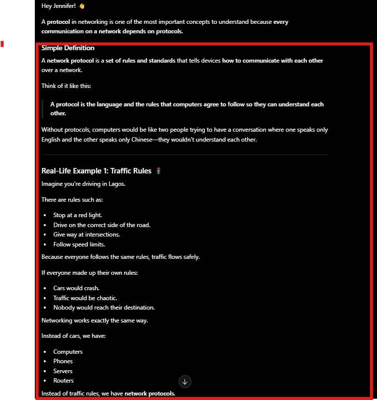
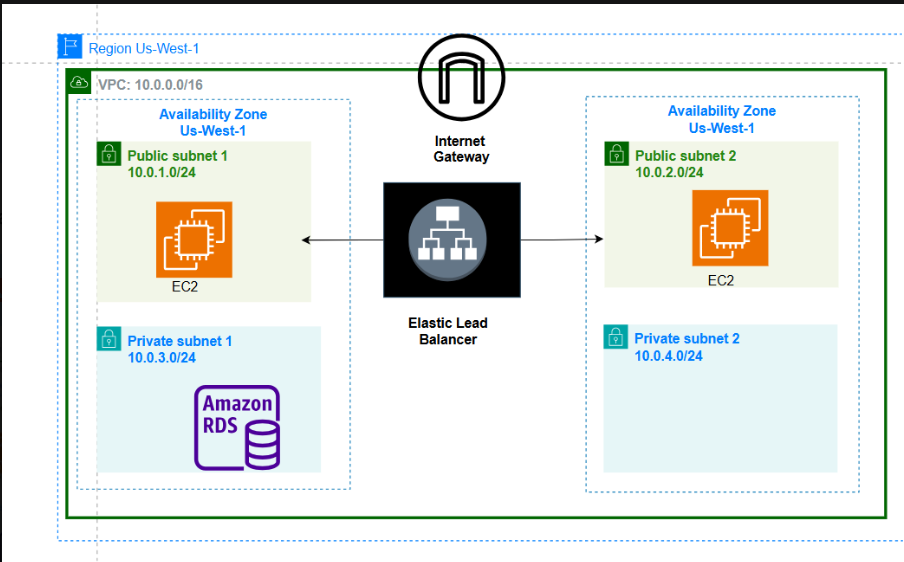
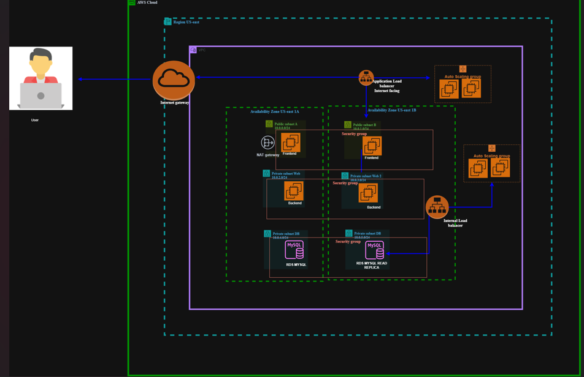
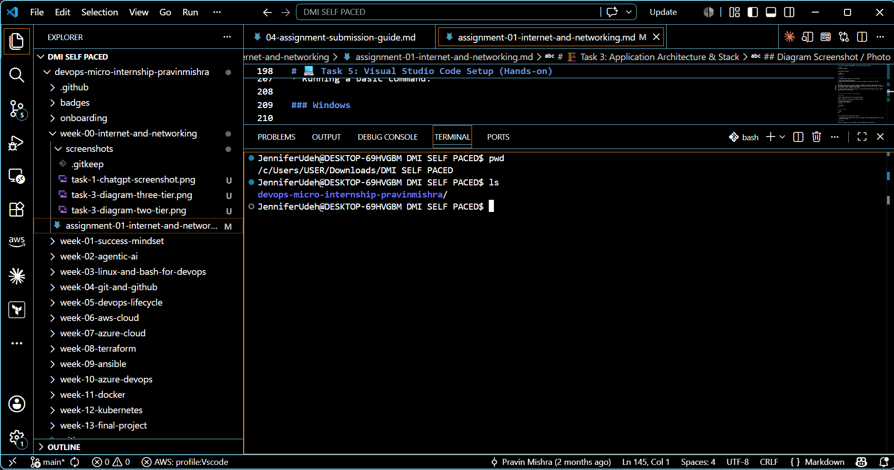

# Week 00 - Internet and Networking

Par                         t of the DevOps Micro Internship (DMI) Cohort 3 with Agentic AI

---

# 🧑‍💻 Task 1: Using ChatGPT as Your Learning Assistant

## Scenario

You're new to DevOps and will frequently encounter technical questions. ChatGPT can be your learning companion.

## Your Task

Write a clear ChatGPT prompt to help you understand:

> "What is a protocol in networking? Explain with a simple real-life example."

Take a screenshot of your interaction showing:

* Your detailed prompt (with clear expectations)
* ChatGPT's simplified response with an example

## Screenshot

Save your screenshot in the `screenshots` folder and update the file name below.




Replace `task-1-chatgpt.png` with your actual screenshot file name.

---

## What I Learned (2–3 lines)

My prompt  
With a detailed simple real-life examples explain What is a protocol in networking? 

Chatgpt reply 
Hey Jennifer! 👋

A protocol in networking is one of the most important concepts to understand because every communication on a network depends on protocols.

Simple Definition

A network protocol is a set of rules and standards that tells devices how to communicate with each other over a network.

Think of it like this:

A protocol is the language and the rules that computers agree to follow so they can understand each other.

Without protocols, computers would be like two people trying to have a conversation where one speaks only English and the other speaks only Chinese—they wouldn't understand each other.

Real-Life Example 1: Traffic Rules 🚦

Imagine you're driving in Lagos.

There are rules such as:

Stop at a red light.
Drive on the correct side of the road.
Give way at intersections.
Follow speed limits.

Because everyone follows the same rules, traffic flows safely.

If everyone made up their own rules:

Cars would crash.
Traffic would be chaotic.
Nobody would reach their destination.

Networking works exactly the same way.

Instead of cars, we have:

Computers
Phones
Servers
Routers

Instead of traffic rules, we have network protocols....

---

# 🌐 Task 2: Internet and Networking

## Scenario

Your friend is launching an online bookstore named **EpicReads**.

He asked you to explain how users globally can access his website hosted in Finland.

## Your Task

Write a short explanation (**100–150 words**) that includes:

* Packet Switching
* IP Address
* TCP/IP
* HTTP/HTTPS

💡 **Tip:** You may use ChatGPT (as demonstrated in Task 1) to refine your explanation.

## Answer

When for example Jane in Nigeria or anywhere in the world visits the **EpicReads** website, the browser first uses the website's **IP address**, which is the unique numerical address that identifies the server hosting the site in Finland. The request is then broken into small pieces called **packets** through a process known as **packet switching**. Each packet may travel along different routes across the internet before reaching the server. The **TCP/IP** protocol suite ensures that the packets are correctly addressed, transmitted, reassembled in the right order, and retransmitted if any are lost. Once the connection is established, **HTTP** (Hypertext Transfer Protocol) or the more secure **HTTPS** is used to exchange web pages and data between the user's browser and the server. HTTPS also encrypts the communication, protecting users' personal information and making online browsing more secure.
...

---

# 🏗️ Task 3: Application Architecture & Stack

## Scenario

EpicReads bookstore has two application versions:

### Two-Tier Application

* Frontend
* Database

### Three-Tier Application

* Frontend
* Backend
* Database

## Your Task

* Draw simple diagrams (hand-drawn or tool-based such as draw.io)
* Label each layer clearly
* List at least two common technologies or tools used for each layer
* Submit a screenshot or photo clearly showing your own drawing

## Diagram Screenshot / Photo

Save your diagram image in the `screenshots` folder and update the file name below.






---

## Technologies Used

### Frontend

Amazon EC2 (hosts the frontend/web application)
HTML, CSS, JavaScript (used to build the user interface)

### Backend

Amazon EC2 (hosts the backend application)
Node.js with Express.js

### Database

Amazon RDS MySQL
MySQL
---

# 🌍 Task 4: Domain Name & DNS (Basic Concepts)

## Scenario

Your friend's bookstore **EpicReads** is currently accessible through:

```text
52.172.142.222:3000
```

He purchased the domain:

```text
epicreads.com
```

## Your Task

In **50–100 words**, explain in your own words:

1. What is DNS (Domain Name System)?
2. Which DNS record type should be used to connect the domain to the given IP, and why?

## Answer

DNS (Domain Name System) is like the internet's phonebook. It changes a website name, such as epicreads.com, into an IP address that computers can understand. This makes it easier for people to visit websites without remembering long numbers.

To connect epicreads.com to 52.172.142.222, an A record should be used because it links a domain name directly to an IPv4 address....

---

# 💻 Task 5: Visual Studio Code Setup (Hands-on)

## Your Task

Install Visual Studio Code (if not already installed).

Take a screenshot of your VS Code environment showing:

* Terminal open inside VS Code
* Running a basic command:

### Windows

```powershell
dir
```

### Linux / macOS

```bash
pwd
ls
```

* Your selected VS Code theme clearly visible

⚠️ **Important:** The screenshot must show your username or another identifiable detail to confirm it is your environment.

## Screenshot

Save your screenshot in the `screenshots` folder and update the file name below.




---

# 🔗 Task 6: Publish Your Assignment as a LinkedIn Post

## Objective

Publishing on LinkedIn helps you:

* Build your professional online presence
* Reinforce your learning
* Document your DevOps journey publicly

## Your Task

Summarize your answers from Tasks 1–5 into a LinkedIn post.

Clearly structure your post into the following sections:

* ChatGPT
* Internet & Networking
* App Architecture
* DNS
* VS Code Setup

Add the following credit note at the end of your post:

> **P.S. This post is part of the DevOps Micro Internship (DMI) with Agentic AI — Cohort 3 — by Pravin Mishra. My graded progress is public: https://dmi.pravinmishra.com/s/YOUR-GITHUB-USERNAME.html · Start your DevOps journey: https://dmi.pravinmishra.com/?utm_source=student&utm_medium=ps-linkedin&utm_campaign=cohort3**

---

## LinkedIn Post URL

Paste your LinkedIn post URL here:

```text
https://www.linkedin.com/posts/jennifer-ifesinachi-udeh_the-internet-works-because-billions-of-devices-share-7488912105283235840-Hyk6/?utm_source=share&utm_medium=member_desktop&rcm=ACoAAFSVTNcBifpKhCEFba52OC8w7ZabwcMcXHw...
```

---

## LinkedIn Post Backup Copy

Paste the full text of your LinkedIn post here:

The internet works because billions of devices agree to follow the same rules.

After being away from LinkedIn for a little over two months, I'm back and it feels good to be sharing again.

This week, I revisited some networking fundamentals as part of the DevOps Micro Internship (DMI). Not because they were new to me, but because every cloud deployment, API request, and web application depends on these concepts.

One scenario involved an online bookstore called EpicReads, and it was a good reminder of what happens behind the scenes every time we open a website.

Here are a few takeaways:
🌐 Networking
Data doesn't travel as one large file, it is broken into packets and sent across the internet using packet switching.

Every server has an IP address, which allows devices to locate it.

TCP/IP ensures data is delivered reliably and in the correct order.

HTTP and HTTPS define how browsers and web servers communicate, with HTTPS adding encryption for secure communication.

🏗️ Application Architecture
 I also revisited the difference between two-tier and three-tier architectures.
A two-tier application connects the frontend directly to the database.

A three-tier architecture introduces a backend layer between the frontend and the database, making applications more scalable, secure, and easier to maintain.

🌍 DNS
 A website may run on an IP address, but users don't remember numbers. DNS maps a domain name like epicreads.com to its IP address, allowing users to access the application using a simple, memorable name.

💻 Development Environment
 Finally, I completed my VS Code setup to prepare for the hands-on labs and projects coming in the next phase of the internship.

One thing I've learned over the past year is that becoming better in cloud and DevOps isn't about chasing new technologies every week. It's about strengthening the fundamentals that everything else is built on.

I'm looking forward to sharing more of what I build and learn in the weeks ahead.

> **P.S. This post is part of the DevOps Micro Internship (DMI) with Agentic AI — Cohort 3 — by Pravin Mishra. My graded progress is public: https://lnkd.in/e7yyK2CH · Start your DevOps journey: https://lnkd.in/eAGp-JfR...

---

# Reflection – Week 0

### What did you find easy?

I was already familiar with most of the topics covered this week, including VS Code setup, networking protocols, and basic application architecture. Revisiting these concepts helped reinforce my existing knowledge and reminded me of how important they are in cloud computing and DevOps....

---

### What was difficult?

I wouldn't say any of the topics were particularly difficult. However, revisiting DNS gave me a deeper understanding of how domain names are translated into IP addresses and how different DNS records are used in real-world scenarios. It helped me connect the theory with practical applications...

---

### What will you improve next week?

Next week, I want to focus more on the practical side by spending more time building and troubleshooting. My goal is to strengthen my hands-on DevOps skills, improve my understanding of cloud services and networking, and stay consistent in documenting my learning journey....

---

## 📌 About DMI & CloudAdvisory

DevOps Micro Internship (DMI) is a project-based DevOps program run by Pravin Mishra (The CloudAdvisory) focused on real-world execution, systems thinking, and career readiness.

It helps learners build strong DevOps foundations with hands-on experience.


## 📌 Resources

- 🌐 **DMI Official Website:** https://dmi.pravinmishra.com?utm_source=github&utm_medium=readme  
- 🎓 **University:** https://university.pravinmishra.com?utm_source=github&utm_medium=readme  
- 💬 **Discord Community:** https://discord.pravinmishra.com?utm_source=github&utm_medium=readme  
- 📝 **Blog:** https://dmi.pravinmishra.com/blog?utm_source=github&utm_medium=readme  
- ▶️ **YouTube Playlist (DMI Cohort 3):** https://www.youtube.com/playlist?list=PLFeSNDtI4Cho  
- 🔗 **Pravin Mishra (LinkedIn):** https://www.linkedin.com/in/pravin-mishra-aws-trainer/  
- 🏢 **CloudAdvisory (LinkedIn):** https://www.linkedin.com/company/thecloudadvisory/

---

*This submission is part of DevOps Micro Internship (DMI) Cohort 3 — Agentic AI Track*