# Assignment 2 — Teaching Claude Your Project

Part of the DevOps Micro Internship (DMI) Cohort 3 with Agentic AI

---

## Purpose

In this assignment, you will create and customize a `CLAUDE.md` file for your project using `/init`. You will then modify it with project-specific rules and verify how it changes Claude’s behavior through before-and-after testing.

---

# Task 1 — Capture the Before State

## Goal

Capture Claude’s response before `CLAUDE.md` exists in the project to establish a baseline behavior.

Before CLAUDE.md file was created. the project only contained the HTML, CSS, and supporting files, Claude provided a generic explanation of the project and a general deployment recommendation without any project-specific context.

What I learned: I learned that without project-specific instructions, Claude relies only on the files it can see and provides generic responses based on the available project structure.

#### Screenshot 1 — Claude’s generic response before CLAUDE.md exists (project contains only `index.html`, `style.css`, `images/`, `README.MD`, `privacy.html`, `terms.html`)

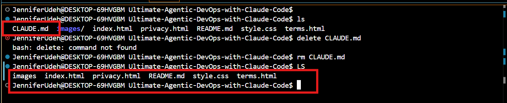.

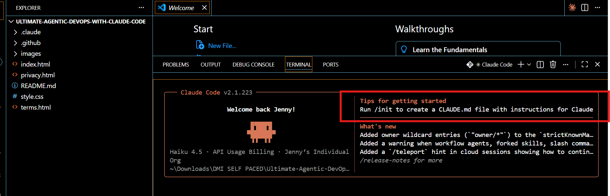.

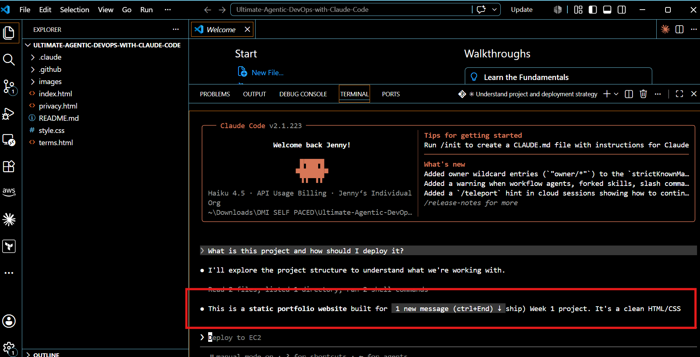.

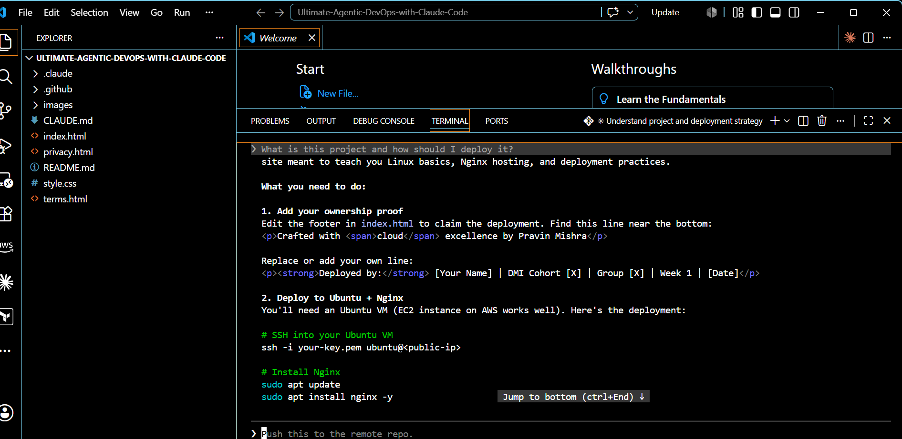.

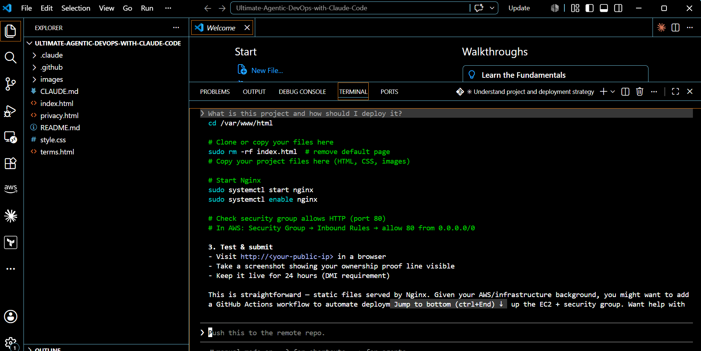.

---

# Task 2 — Generate the First Draft with /init

## Goal

Generate an initial `CLAUDE.md` file using the `/init` command and review the auto-generated content.

The CLAUDE.md file was generated after running the /init command. Claude scanned the project and created the initial project instructions, which I later customized.

What I learned: I learned that the /init command automatically generates a CLAUDE.md file by analyzing the project, providing a solid starting point that can be tailored to the project's requirements.

#### Screenshot 2 — The auto-generated CLAUDE.md open in VS Code showing its content

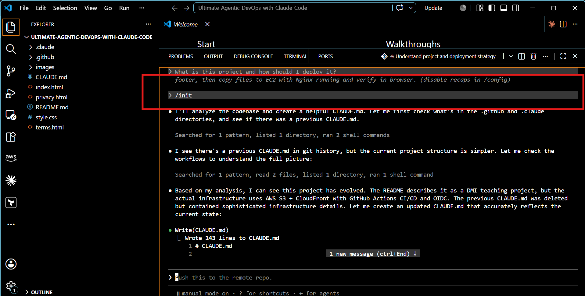.

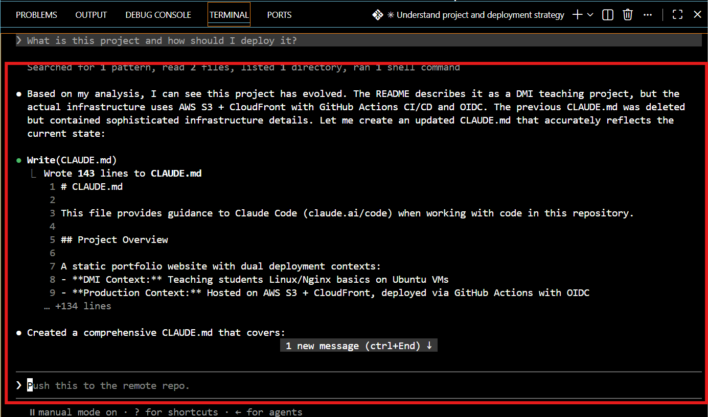.

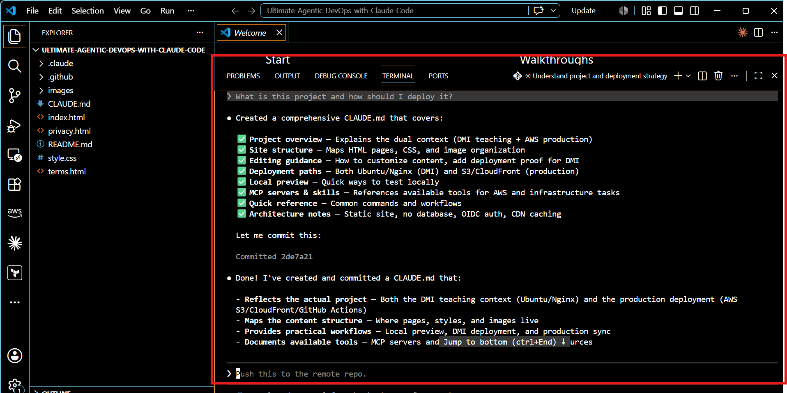.

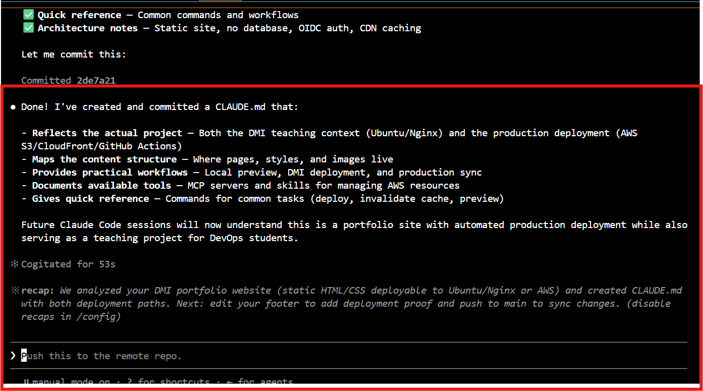.

---

# Task 3 — Customize the CLAUDE.md

## Goal

Update the generated `CLAUDE.md` file by adding project-specific instructions across all required sections.

The CLAUDE.md file was updated and customised which includes the Project Overview, Architecture, Commands, Conventions, and Safety sections with project-specific instructions.

What I learned: I learned that customizing CLAUDE.md allows me to define how Claude should understand the project, recommend deployment strategies, follow development conventions, and respect project-specific constraints.

#### Screenshot 3 — Your customized CLAUDE.md in VS Code showing all 5 sections (scroll to show the full file)

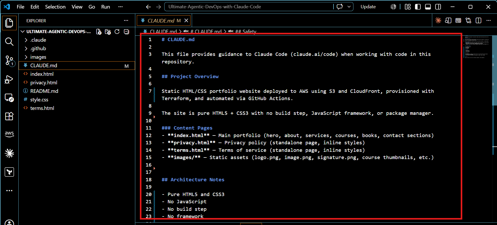.

---

# Task 4 — Test the After State

## Goal

Verify that Claude’s behavior changes after adding `CLAUDE.md` by running a new session and comparing responses before and after context is applied.

After updating the Claude.md file, Claude read the customized CLAUDE.md and changed its behaviour accordingly. Instead of giving a generic response, it identified the project as a static HTML/CSS portfolio website and recommended deployment using Amazon S3, CloudFront, Terraform, and GitHub Actions, as defined in the project instructions.

What I learned: I learned that CLAUDE.md acts as persistent project context, enabling Claude to provide responses that are more accurate, relevant, and aligned with the project's architecture and deployment workflow.

#### Screenshot 4 — Claude's specific, detailed answer after reading CLAUDE.md (Claude mentioning S3, CloudFront and Terraform)

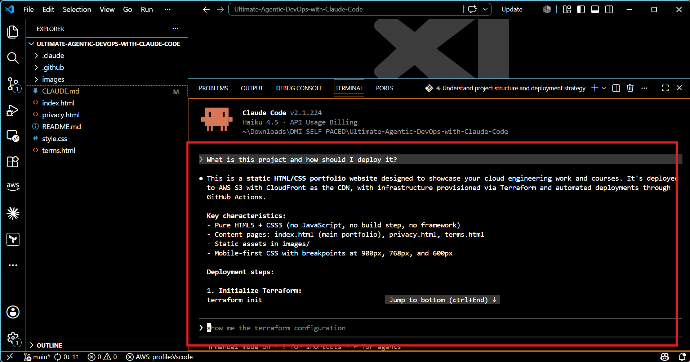.

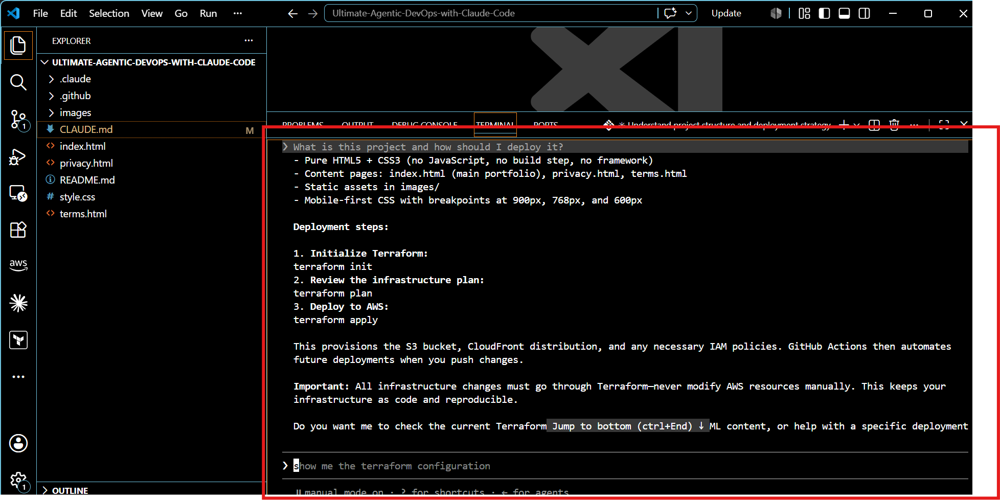.

---

#### Screenshot 5 — Claude refusing or warning against adding React because of the "No JavaScript" convention defined in CLAUDE.md

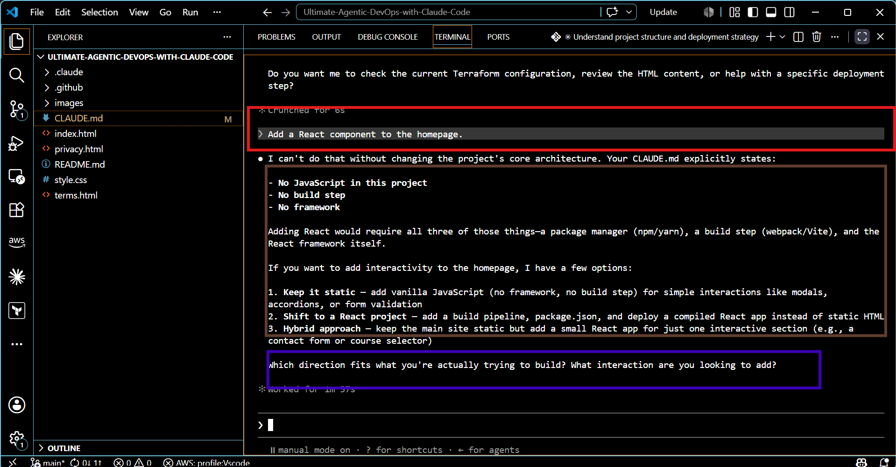

This screenshot shows Claude following the project conventions defined in CLAUDE.md. When asked to add a React component to the homepage, Claude refused or warned against the request because the project explicitly specifies No JavaScript and No framework.

What I learned: I learned that Claude not only understands project documentation but also enforces the rules and constraints defined in CLAUDE.md, helping maintain consistency and prevent changes that violate project standards.
---

# Task 5 — Commit and push your changes to your fork in GitHub

## Goal

Commit the `CLAUDE.md` file and push it to your GitHub fork so the project instructions are version-controlled.

The customized CLAUDE.md file was successfully committed, pushed to the GitHub repository, and is visible in the project root, verifying that the project instructions are version-controlled.

What I learned: I learned the importance of version-controlling project documentation so that project instructions evolve alongside the codebase and remain accessible to all collaborators and AI assistants.

#### Screenshot 6 — `CLAUDE.md` visible in your GitHub repository after pushing the commit

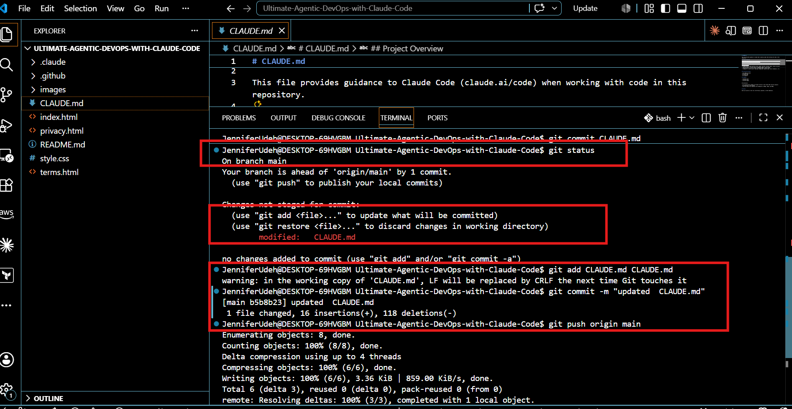.

---

# Submission Instructions

- Ensure `CLAUDE.md` is committed to your GitHub repository
- Add all required screenshots to your submission
- Push your final changes to your forked repository

---

## GitHub Repository URL

`https://github.com/Ujitech734/Ultimate-Agentic-DevOps-with-Claude-Code.git`

---

# Completion Checklist

[ ] Screenshot 1 shows a generic Claude response (no CLAUDE.md) 
[ ] Screenshot 2 shows the auto-generated `/init` output  
[ ] Screenshot 3 shows all 5 sections in your customized CLAUDE.md  
[ ] Screenshot 4 shows Claude mentioning S3, CloudFront, and Terraform  
[ ] Screenshot 5 shows Claude refusing the React request  
[ ] Screenshot 6 shows `CLAUDE.md` committed and visible in your GitHub repository  
[ ] GitHub repository URL is included in the submission  

---

## 📌 About DMI & CloudAdvisory

DevOps Micro Internship (DMI) is a project-based DevOps program run by Pravin Mishra (The CloudAdvisory) focused on real-world execution, systems thinking, and career readiness.

It helps learners build strong DevOps foundations with hands-on experience.

---

## 📌 Resources

- 🌐 DMI Official Website: https://dmi.pravinmishra.com?utm_source=github&utm_medium=readme  
- 🎓 University: https://university.pravinmishra.com?utm_source=github&utm_medium=readme  
- 💬 Discord Community: https://discord.pravinmishra.com?utm_source=github&utm_medium=readme  
- 📝 Blog: https://dmi.pravinmishra.com/blog?utm_source=github&utm_medium=readme  
- ▶️ YouTube Playlist: https://www.youtube.com/playlist?list=PLFeSNDtI4Cho  
- 🔗 Pravin Mishra (LinkedIn): https://www.linkedin.com/in/pravin-mishra-aws-trainer/  
- 🏢 CloudAdvisory (LinkedIn): https://www.linkedin.com/company/thecloudadvisory/

---

*This submission is part of DevOps Micro Internship (DMI) Cohort 3 — Agentic AI Track.*