# Assignment 3 — Building Your Command Center

Part of the DevOps Micro Internship (DMI) Cohort 3 with Agentic AI

---

## Purpose

In this assignment, you will build a local Claude Skills system by creating the `.claude/skills/` folder structure, adding predefined skill files, and executing a real agentic command (`/scaffold-terraform`) to generate infrastructure code. You will also observe how skills enforce tool restrictions and enable controlled automation.

---

# Task 1 — Create the Skill Folder Structure

## Goal

Create the required `.claude/skills/` directory structure for all skills.

I created the required .claude/skills/ directory structure inside the project and added the four skill subfolders required.

What I learnt:
This task taught me how to organize a local Claude Skills system within a project. each skill have its own directory and configuration, making skills easier to manage and reuse.

#### Screenshot 1 — VS Code sidebar showing `.claude/skills/` folder with all 4 subfolders visible

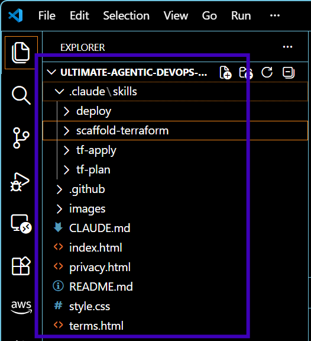.

---

# Task 2 — Add the Skill Files

## Goal

Place all required skill files into their correct directories and verify their configuration.

What I Did

I added the required skill files to their respective directories, including SKILL.md files and the template-spec.md file for the scaffold-terraform skill. I also reviewed the frontmatter configuration of the skills.

For the tf-plan skill, I verified that the configuration included:

allowed-tools: Bash, Read, Grep
disable-model-invocation: true

and that the Write tool was not included.

What I learnt:
I learnt how skill files and frontmatter control how Claude operates within a project. I also learnt how allowed-tools can restrict the tools available to a skill and how disable-model-invocation can prevent automatic model invocation.

This showed me how tool restrictions enable controlled automation rather than giving an agent unrestricted access to project files.

#### Screenshot 2 — `.claude/skills/scaffold-terraform/` open in VS Code showing both `SKILL.md` and `template-spec.md`

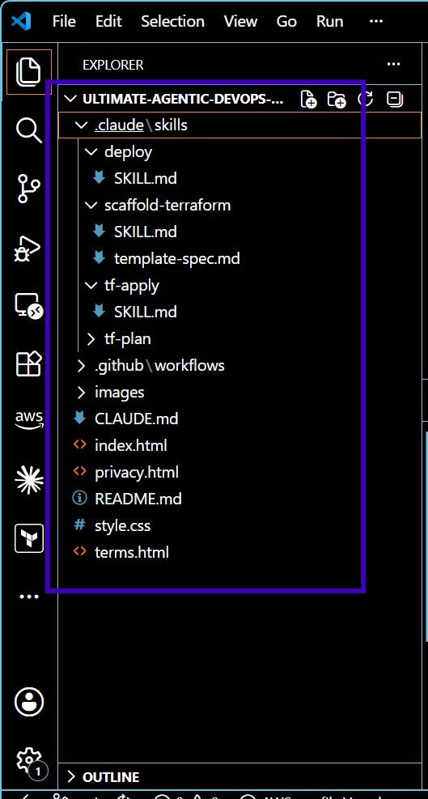.

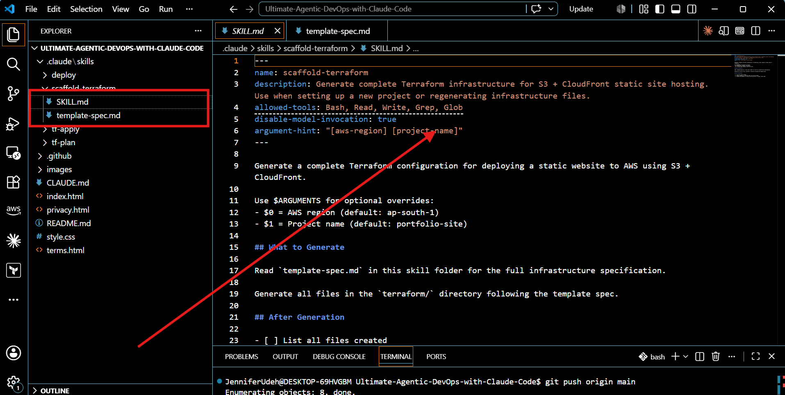.

---

#### Screenshot 3 — Screenshot 3 — `tf-plan/SKILL.md` frontmatter showing `allowed-tools: Bash, Read, Grep` (no Write) and `disable-model-invocation: true`

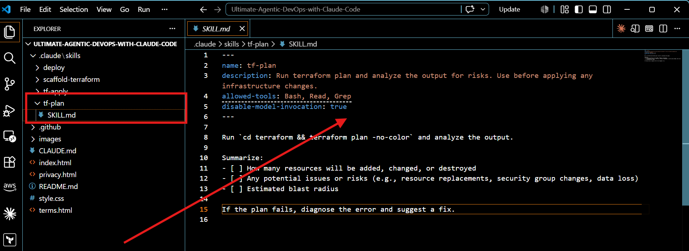.

---

# Task 3 — Run /scaffold-terraform

## Goal

Execute the `/scaffold-terraform` skill to generate a full Terraform infrastructure setup.

What I did
I ran the /scaffold-terraform agentic command to generate the Terraform infrastructure setup. Claude followed the instructions defined by the skill and created the required Terraform files, which I then verified in the VS Code sidebar.

What I learnt
I learnt how a predefined Claude Skill can be used to perform a structured infrastructure task through an agentic command.

I also learnt that skills can provide Claude with specific instructions and constraints, allowing it to generate infrastructure code in a consistent and controlled way instead of relying on an open-ended prompt.

#### Screenshot 4 — Claude's response showing the scaffold complete with the file list

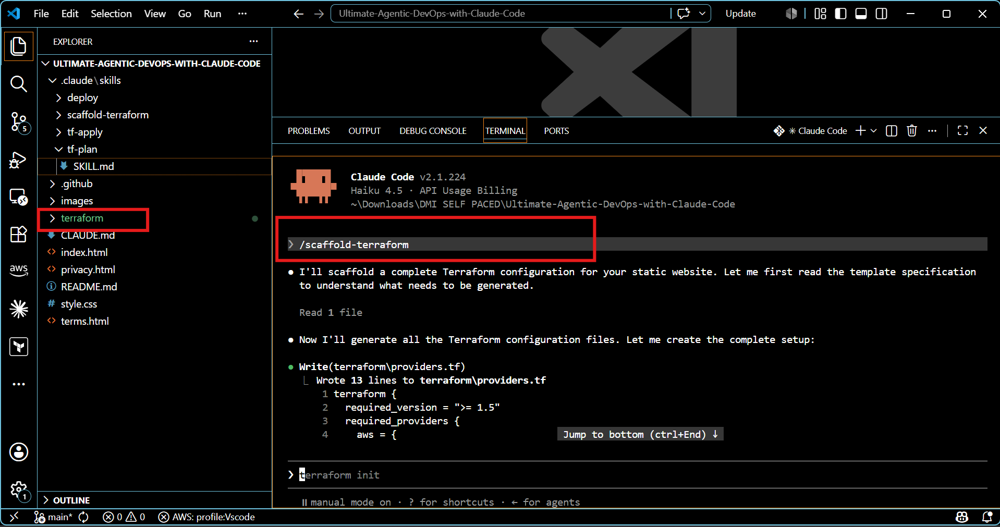.

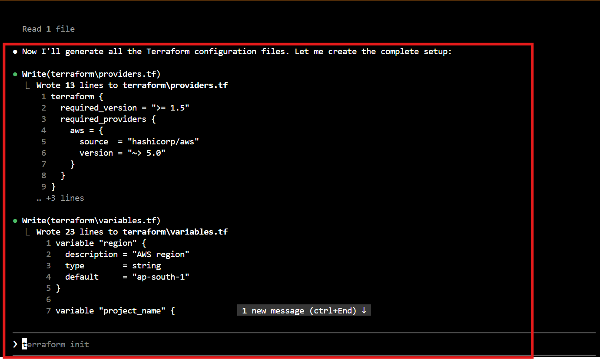.

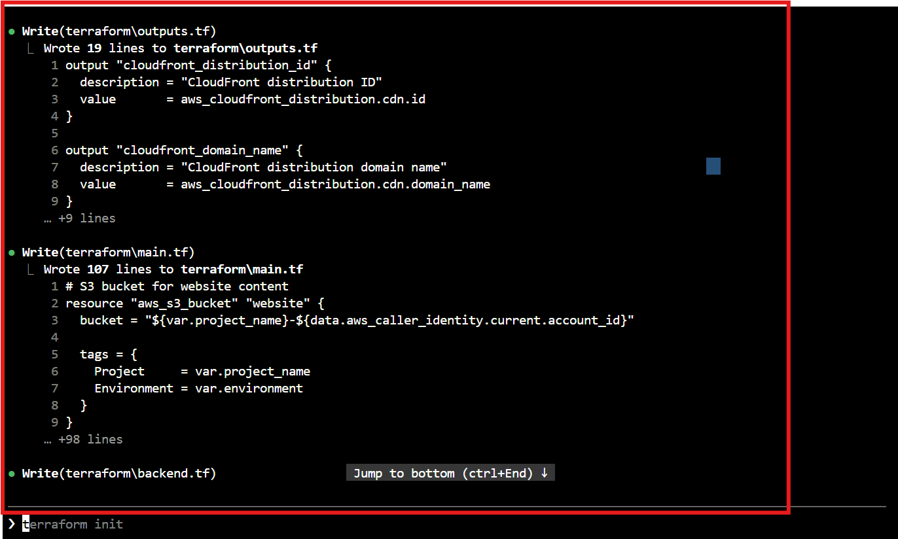.

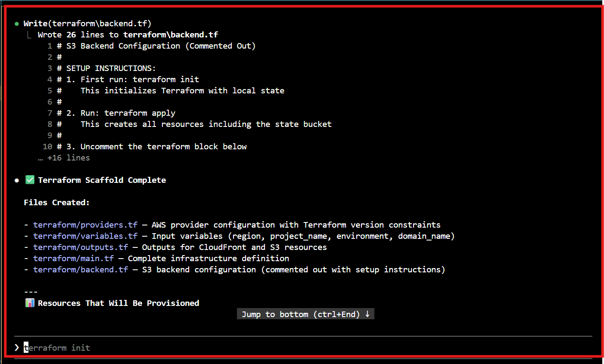.

---

#### Screenshot 5 — VS Code sidebar showing the `terraform/` folder with all generated files inside

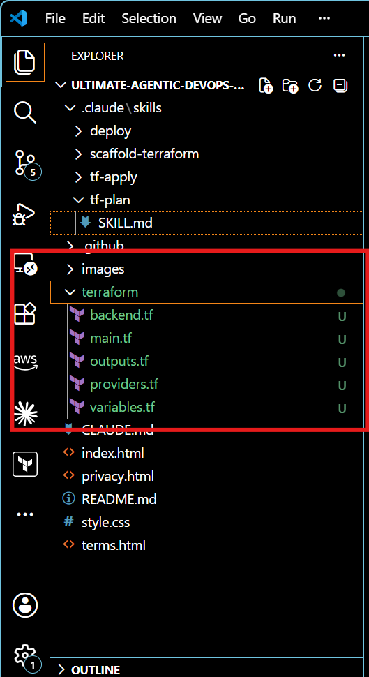.

---

# Task 4 — Run terraform init and /tf-plan

## Goal

Initialize Terraform and execute the `/tf-plan` skill to observe plan execution and output analysis.

What I did
I ran terraform init to initialize the Terraform working directory and download the required provider dependencies. I then executed the /tf-plan skill to run the Terraform plan and analyze the resulting output.

What I learnt
I learnt how terraform init prepares a Terraform working directory for infrastructure operations and how /tf-plan can be used to automate the plan-and-analysis workflow.

I also learnt the importance of reading and interpreting command output, including authentication or configuration errors, rather than treating an error as simply a failed command.

#### Screenshot 6 — Claude's `/tf-plan` response showing it ran the command and analyzed the result (pass or auth error both count)

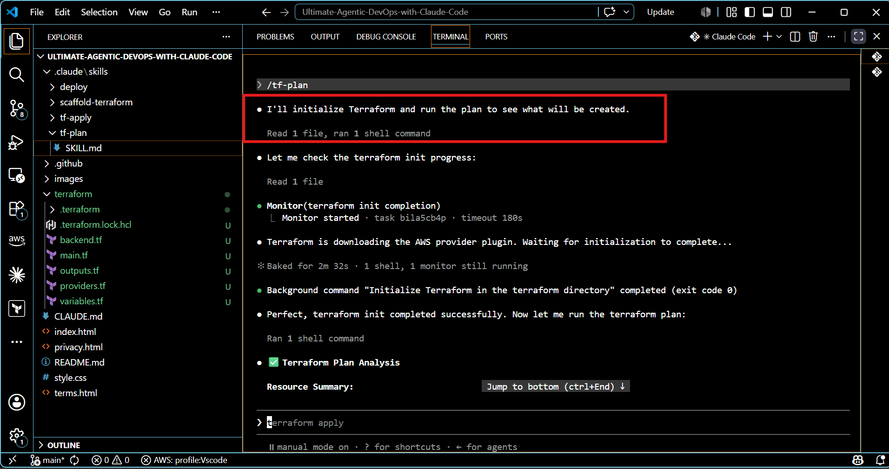.

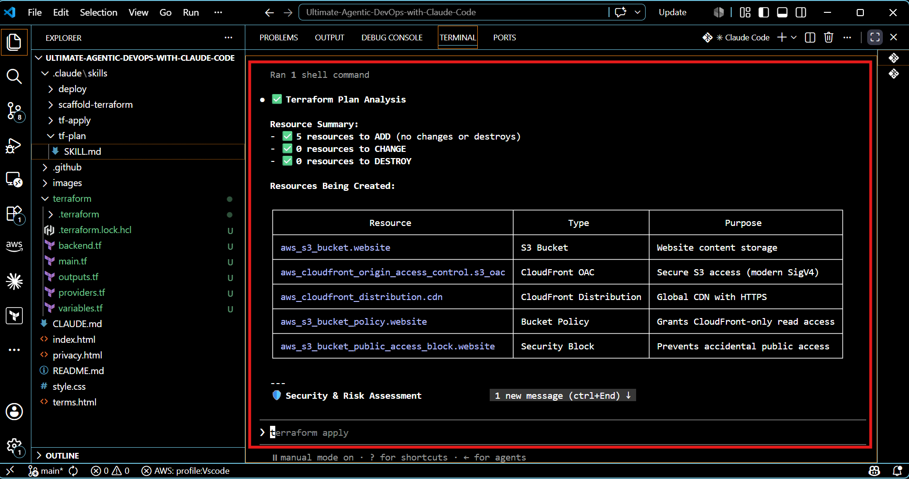.

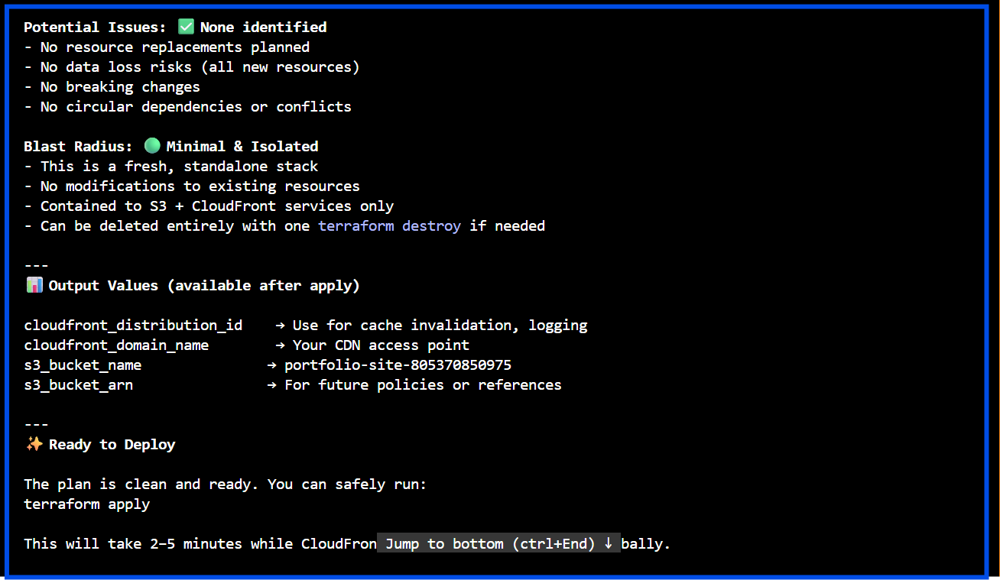.

After completing the tasks, I committed the project changes and pushed the final version to my GitHub repository.

During the process, I encountered a GitHub push rejection because the Terraform .terraform directory contained a 685 MB AWS provider binary, which exceeded GitHub's 100 MB file limit.

I resolved the issue by adding .terraform/ to .gitignore, removing the generated provider files from Git tracking, and rebuilding the affected commit history before pushing again.

The final project was successfully pushed to my GitHub repository.

What I learnt:
This troubleshooting process reinforced the importance of understanding the difference between generated Terraform files and project configuration files. It also strengthened my understanding of Git tracking, .gitignore, commit history, and GitHub's file-size limitations.

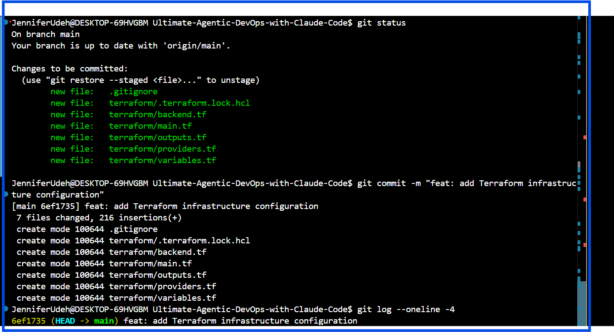.

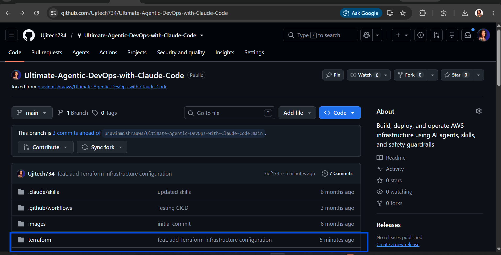.
---

# Submission Instructions

- Ensure `.claude/skills/` folder and all skill files are committed to your GitHub repository
- Run all commands successfully and capture required screenshots
- Push final changes to your forked repository

---

## GitHub Repository URL

Paste your forked repository URL here:

`https://github.com/Ujitech734/Ultimate-Agentic-DevOps-with-Claude-Code.git`

## LinkedIn post URL

Paste your forked repository URL here:

`https://www.linkedin.com/posts/jennifer-ifesinachi-udeh_ive-pushed-code-to-github-many-times-this-ugcPost-7492501952648458240-15-2/?utm_source=share&utm_medium=member_desktop&rcm=ACoAAFSVTNcBifpKhCEFba52OC8w7ZabwcMcXHw`
---

# Completion Checklist

- [ ] `.claude/skills/` folder created with all 4 skill folders
- [ ] All skill files placed correctly
- [ ] `tf-plan/SKILL.md` shows correct `allowed-tools` restrictions
- [ ] `/scaffold-terraform` executed successfully
- [ ] Terraform files generated inside `terraform/` folder
- [ ] `terraform init` executed successfully
- [ ] `/tf-plan` executed and output analyzed by Claude
- [ ] All required screenshots added
- [ ] GitHub repository URL included
- [ ] LinkedIn post URL included

---

## 📌 About DMI & CloudAdvisory

DevOps Micro Internship (DMI) is a project-based DevOps program run by Pravin Mishra (The CloudAdvisory) focused on real-world execution, systems thinking, and career readiness.

It helps learners build strong DevOps foundations with hands-on experience.

---

## 📌 Resources

- 🌐 DMI Official Website: https://dmi.pravinmishra.com?utm_source=github&utm_medium=readme  
- 🎓 University: https://university.pravinmishra.com?utm_source=github&utm_medium=readme  
- 💬 Discord Community: https://discord.pravinmishra.com?utm_source=github&utm_medium=readme  
- 📝 Blog: https://dmi.pravinmishra.com/blog?utm_source=github&utm_medium=readme  
- ▶️ YouTube Playlist: https://www.youtube.com/playlist?list=PLFeSNDtI4Cho  
- 🔗 Pravin Mishra (LinkedIn): https://www.linkedin.com/in/pravin-mishra-aws-trainer/  
- 🏢 CloudAdvisory (LinkedIn): https://www.linkedin.com/company/thecloudadvisory/

---

*This submission is part of DevOps Micro Internship (DMI) Cohort 3 — Agentic AI Track.*