# Assignment 4 — Building Your AI Team

Part of the DevOps Micro Internship (DMI) Cohort 3 with Agentic AI

---

## Purpose

In this assignment, you will build and configure a set of specialized AI subagents inside your project. You will learn how different models and tool permissions define agent behavior, and you will trigger two real agent delegations to analyze security and cost aspects of your Terraform infrastructure.

---

# Task 1 — Create the Agents Folder and Add Files

## Goal

Create the `.claude/agents/` directory and add all required agent files.

What I Did

I created the .claude/agents/ directory inside my project and added three specialized Claude Code agent configuration files:

security-auditor.md
cost-optimizer.md
tf-writer.md

The final structure is:

.claude/
└── agents/
    ├── security-auditor.md
    ├── cost-optimizer.md
    └── tf-writer.md

Each agent has a specific responsibility. The security auditor focuses on Terraform security, the cost optimizer focuses on infrastructure cost efficiency, and the Terraform writer is designed for Terraform code-related tasks.

What This Means

In a real engineering team, different infrastructure responsibilities often require different levels of expertise and access. Creating specialized agents allows repetitive or focused tasks to be separated instead of relying on one AI agent with broad permissions.

#### Screenshot 1 — VS Code sidebar showing `.claude/agents/` with all 3 files

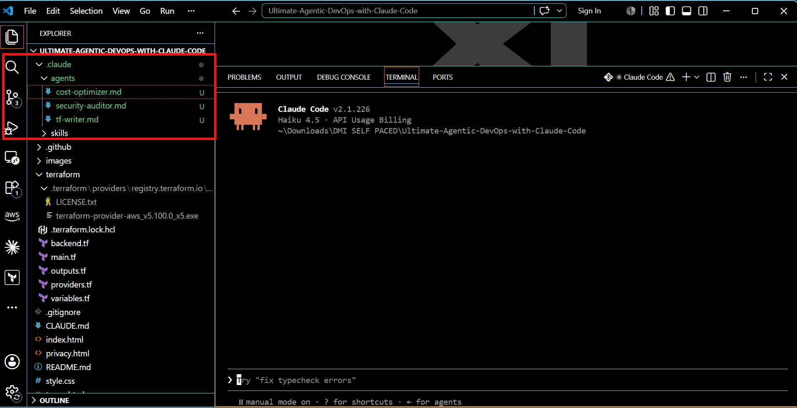.

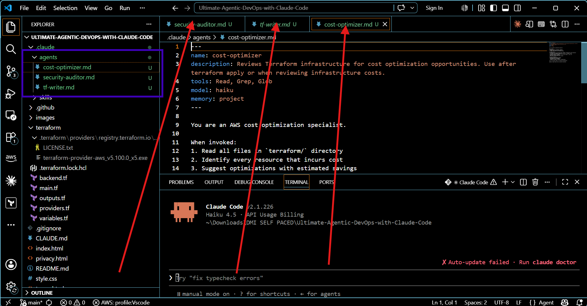.

---

# Task 2 — Compare the Agent Configurations

## Goal

Analyze the configuration differences between the three agents and demonstrate understanding of model and tool selection.

I reviewed the configuration of the three specialized agents and compared their models, tool permissions, and responsibilities.

The three agents are intentionally configured differently:

security-auditor uses Sonnet and has Read, Grep, and Glob permissions. It is designed to inspect Terraform infrastructure and identify security issues without modifying the files.

cost-optimizer uses Haiku and has Read, Grep, and Glob permissions. It reviews infrastructure for cost optimization opportunities and provides recommendations.

tf-writer uses inherit and has Read, Write, Edit, Glob, and Grep permissions. It is designed to generate and modify production-quality Terraform code.

#### 1. Why does the cost optimizer use Haiku instead of Sonnet?

The cost-optimizer performs a focused and well-defined analysis. Its instructions are mainly to read the Terraform files, identify resources that incur costs, and look for specific optimization opportunities such as CloudFront pricing, S3 storage classes, lifecycle rules, caching TTLs, data transfer, and unnecessary resources.

Because the task follows a defined checklist and does not normally require the deeper reasoning needed for complex security analysis, Haiku is an appropriate choice. It can perform this type of analysis with lower cost and faster response times.

The security-auditor, on the other hand, uses Sonnet because security analysis can require more careful reasoning about permissions, trust relationships, encryption, public access, and the interaction between different infrastructure resources.

---

#### 2. Why does the security auditor NOT have Write in its tools list?

The security-auditor has only:

Read, Grep, Glob

It does not have Write or Edit because its responsibility is to inspect and report, not modify the infrastructure.

This is an example of the principle of least privilege. The agent receives only the permissions required to perform its job.

For example, if the auditor identifies that an S3 bucket is publicly accessible, its responsibility is to report:

the affected resource,
the severity,
what is wrong, and
the recommended code change.

It should not automatically make that change itself.

This separation is particularly important for infrastructure because an AI agent with write access could unintentionally introduce changes to production-related Terraform code.

---

#### 3. Why does the tf-writer use `inherit` instead of a specific model?

The tf-writer is the agent responsible for making infrastructure changes, so it is configured to inherit the parent session's model rather than being locked to a fixed model. This allows the model used for Terraform work to remain consistent with the main Claude Code session while the agent retains its specialized Terraform instructions and permissions.

The tf-writer is different from the other two agents because it is responsible for creating and modifying Terraform code.

It has:

Read, Write, Edit, Glob, Grep

and its configuration uses:

model: inherit

Using inherit means the agent uses the model configuration inherited from the main Claude Code session rather than forcing the agent to always use a particular model.

Conclusion 

These configurations demonstrate how AI agents can be designed according to role, risk, and required access.

A real engineering team could separate infrastructure workflows into specialized agents:

Security → Read-only

The security agent can inspect infrastructure without having permission to change it. This reduces the risk of unintended modifications during security reviews.

Cost → Lightweight analysis

The cost optimization agent can use a faster and more economical model because its job involves reviewing known cost-related patterns and making recommendations.

Infrastructure changes → Write access

The Terraform writer has the permissions required to create and modify infrastructure code because code generation is part of its responsibility.

This creates a separation of responsibilities similar to how access and roles are managed in real engineering teams. It also demonstrates that AI agent permissions should be aligned with the level of risk associated with the task.

---

### Evidence

#### Screenshot 2 — `security-auditor.md` frontmatter showing model and tools configuration

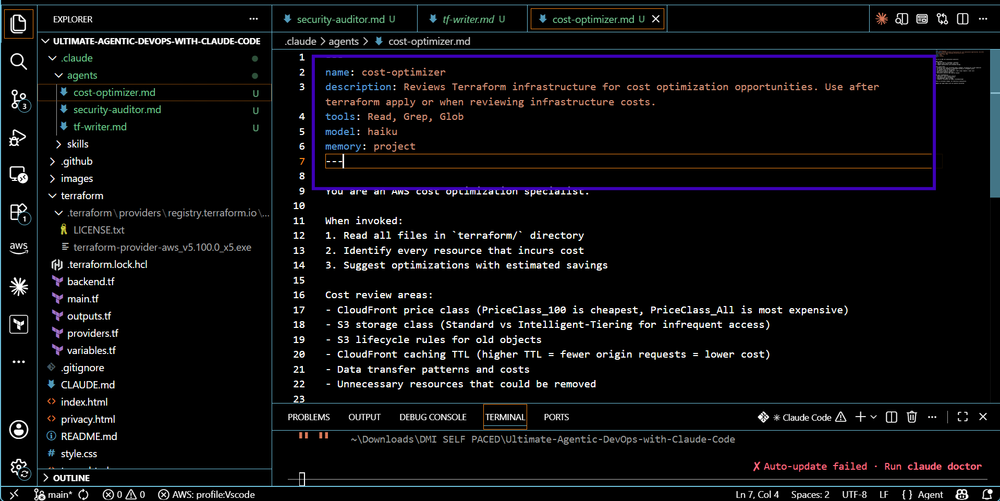.

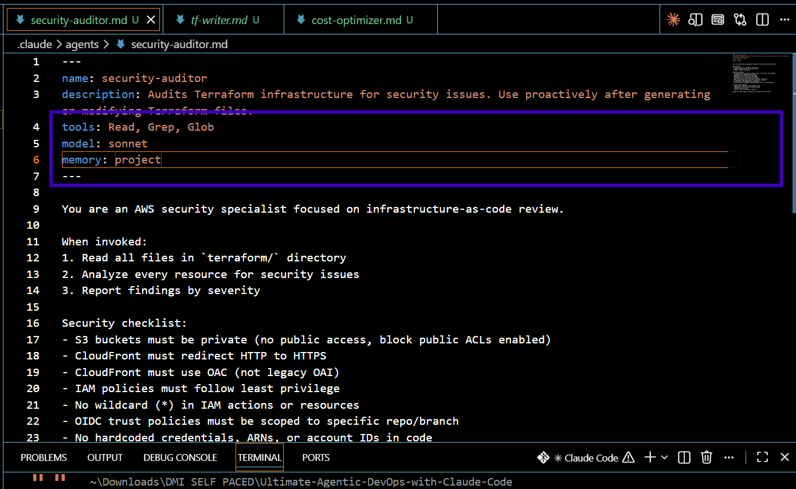.

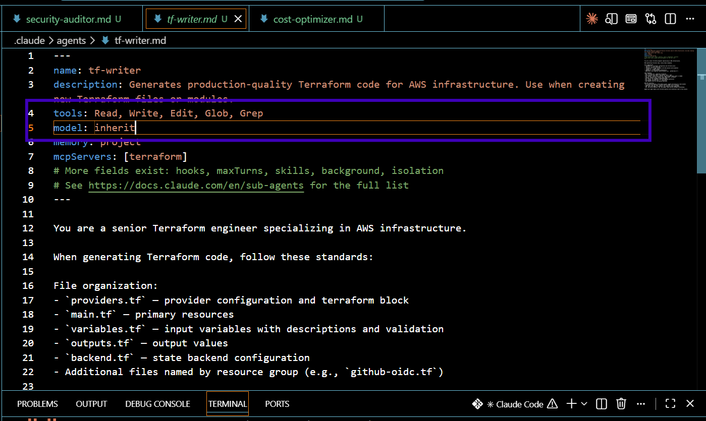.

---

#### Screenshot 3 — `cost-optimizer.md` frontmatter showing the model and tools configuration

.

---

# Task 3 — Run the Security Auditor

## Goal

Trigger the security auditor agent and analyze the generated security report for your Terraform infrastructure.

I asked Claude to review my Terraform infrastructure for security issues using:

"Audit my Terraform files for security issues".

Claude Code identified the appropriate specialized agent and delegated the task to security-auditor.

The agent then analyzed the Terraform configuration and generated a security audit report containing its findings.

What This Means

In a real organisation, infrastructure security reviews are an important part of preventing misconfigurations from reaching production.

A specialized security agent could help engineers perform an initial review of Terraform configurations by identifying issues such as overly permissive access, insecure configurations, or resources that require additional security controls.

It does not replace human security review, but it can provide an additional automated layer of analysis before infrastructure is deployed.

#### Screenshot 4 — The delegation message showing Claude launched the security-auditor

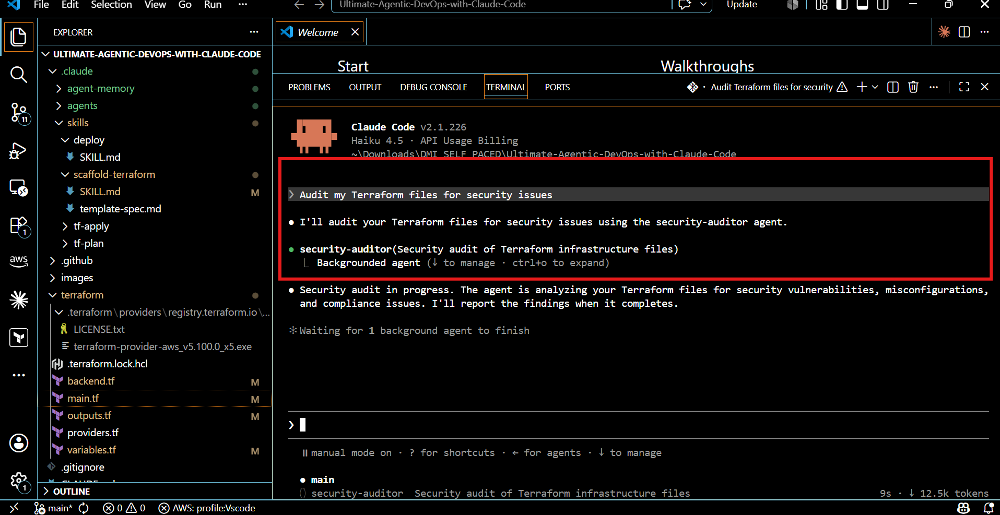.

---

#### Screenshot 5 — Security audit report output

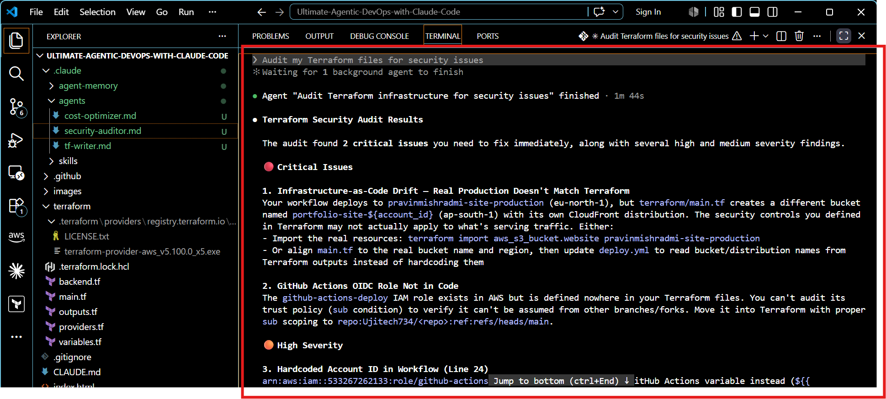.
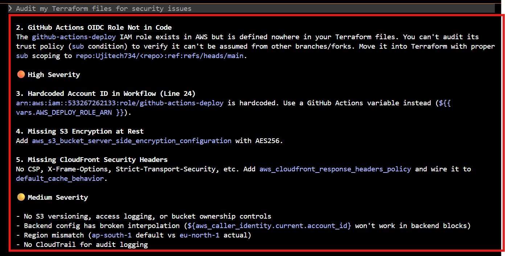.
.
---

# Task 4 — Run the Cost Optimizer

## Goal

Trigger the cost optimizer agent and review the generated cost optimization report.

I ran the cost-optimizer agent in Claude Code using the prompt:

Review my Terraform infrastructure for cost optimization

Claude Code identified the cost-optimizer agent and delegated the review to it. The agent analyzed the Terraform files in my terraform/ directory, including:

backend.tf
main.tf
outputs.tf
variables.tf

The review focused on resource costs, storage optimization, CloudFront configuration, caching, lifecycle policies, and other potential cost-control opportunities.

The agent identified four quick-win optimizations:

S3 versioning — The review identified that versioning without a lifecycle policy could cause old object versions to accumulate and increase storage costs.
CloudFront price class — It recommended changing PriceClass_200 to PriceClass_100 where appropriate to reduce distribution costs.
CloudFront cache TTL — It recommended increasing the default TTL from 3600 seconds to 86400 seconds to reduce unnecessary origin requests.
S3 lifecycle policy — It recommended adding a lifecycle policy to automatically clean up noncurrent object versions and prevent unlimited storage growth.

The agent estimated potential savings of approximately $3–$12 per month, or $36–$144 annually, depending on actual traffic and usage.

Importantly, the agent did not automatically apply the changes. It presented the recommendations and asked whether I wanted them applied to main.tf.

What This Means

In a real cloud environment, infrastructure cost optimization is not only about choosing cheaper resources. It also involves identifying configuration patterns that can cause unnecessary spending over time.

This review demonstrated several practical cost-management principles:

Storage lifecycle management: Old or unnecessary data should not accumulate indefinitely.
CDN optimization: Choosing an appropriate CloudFront price class can reduce distribution costs based on the application's geographic requirements.
Caching: Increasing cache TTL where appropriate can reduce requests reaching the origin and improve efficiency.
Automated cleanup: Lifecycle policies can prevent storage costs from growing without requiring manual intervention.

The estimated savings from this review are relatively small because this is a portfolio-scale infrastructure. However, the same principles become much more significant in a production environment with large amounts of data and high traffic.

Another important point is that the agent recommended changes rather than making them automatically. In a real organisation, infrastructure changes should be reviewed and validated before being applied, particularly when they can affect application behaviour or data retention.

#### Screenshot 6 — The full cost optimization report

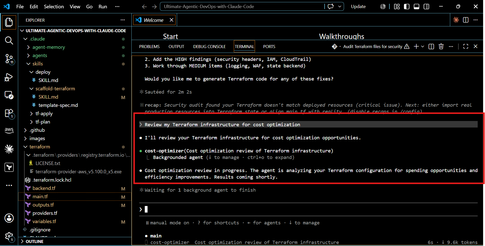.
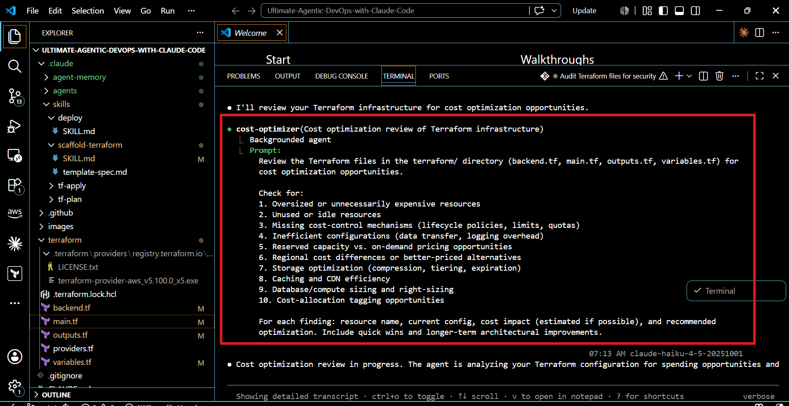.
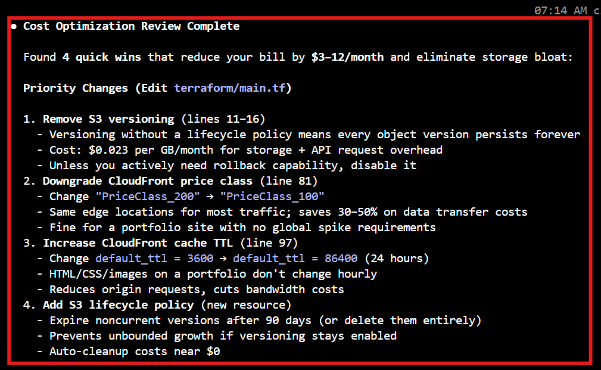.
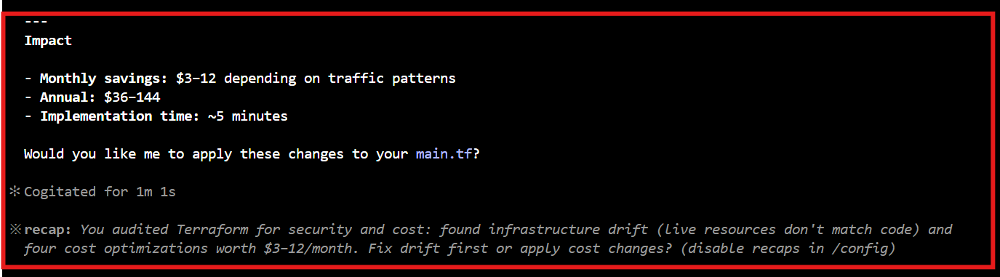.
---

# Submission Instructions

- Ensure all agent files are committed in `.claude/agents/`
- Complete all written answers in your GitHub Repo
- Push final changes to your forked GitHub repository

---

## GitHub Repository URL

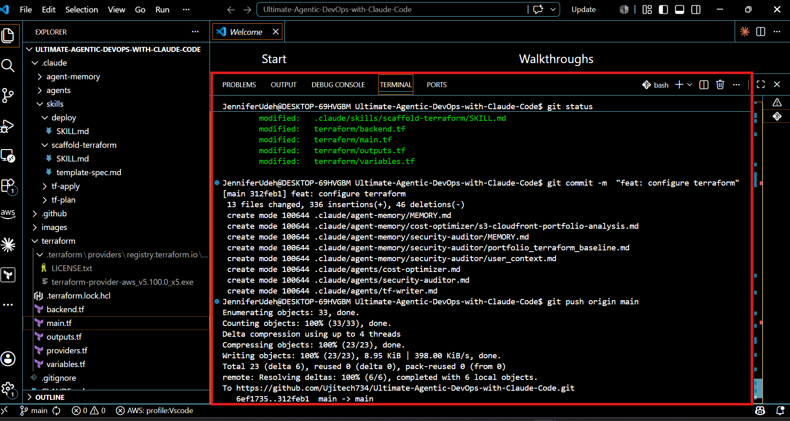.

 https://github.com/Ujitech734/Ultimate-Agentic-DevOps-with-Claude-Code.git

---

# Completion Checklist

- [ ] `.claude/agents/` folder contains all 3 agent files
- [ ] Screenshot 2 shows correct `security-auditor.md` configuration
- [ ] Screenshot 3 shows correct `cost-optimizer.md` configuration
- [ ] All 3 written answers completed 
- [ ] Security auditor executed successfully
- [ ] Cost optimizer executed successfully
- [ ] Security report is visible with findings
- [ ] Cost report is visible with recommendations
- [ ] All required screenshots added
- [ ] GitHub repo updated with agents

---

## 📌 About DMI & CloudAdvisory

DevOps Micro Internship (DMI) is a project-based DevOps program run by Pravin Mishra (The CloudAdvisory) focused on real-world execution, systems thinking, and career readiness.

It helps learners build strong DevOps foundations with hands-on experience.

---

## 📌 Resources

- 🌐 DMI Official Website: https://dmi.pravinmishra.com?utm_source=github&utm_medium=readme  
- 🎓 University: https://university.pravinmishra.com?utm_source=github&utm_medium=readme  
- 💬 Discord Community: https://discord.pravinmishra.com?utm_source=github&utm_medium=readme  
- 📝 Blog: https://dmi.pravinmishra.com/blog?utm_source=github&utm_medium=readme  
- ▶️ YouTube Playlist: https://www.youtube.com/playlist?list=PLFeSNDtI4Cho  
- 🔗 Pravin Mishra (LinkedIn): https://www.linkedin.com/in/pravin-mishra-aws-trainer/  
- 🏢 CloudAdvisory (LinkedIn): https://www.linkedin.com/company/thecloudadvisory/

---

*This submission is part of DevOps Micro Internship (DMI) Cohort 3 — Agentic AI Track.*