# Assignment 5 — Connecting Claude to the Outside World

Part of the DevOps Micro Internship (DMI) Cohort 3 with Agentic AI

---

## Purpose

In this assignment, you will connect Claude Code to external systems using MCP (Model Context Protocol). You will configure the GitHub MCP server, securely store credentials, verify the connection, and run a live query that proves Claude is accessing real-time GitHub data.

---

# Task 1 — Create a GitHub Personal Access Token

## Goal

Generate a GitHub Personal Access Token (PAT) that will be used for MCP authentication.

I created a GitHub Personal Access Token (PAT) to authenticate Claude Code with GitHub through the GitHub MCP server.

I created a classic token with the required repo and read:user scopes and configured an expiration period. I copied the token securely after creation and did not expose the token value in screenshots or commit it to the repository.

Real-World Application

In a real organization, applications and automation tools often need controlled access to external systems such as GitHub. A Personal Access Token can provide authenticated access without using a user's GitHub password.

The important practice is to limit permissions to what the application needs, protect the credential, and define an expiration period to reduce the impact of credential exposure.

#### Screenshot 1 — GitHub token creation page showing the selected scopes (`repo`, `read:user`) — token value must NOT be visible

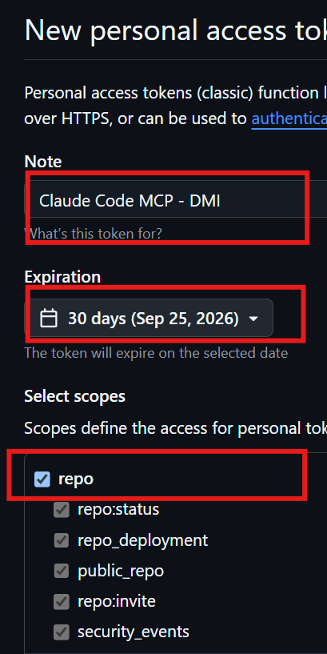.

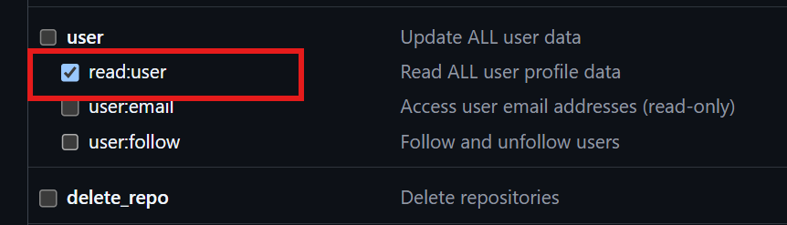.

---

# Task 2 — Create .mcp.json at the Project Root

## Goal

Create and configure the `.mcp.json` file to define the GitHub MCP server.

I created .mcp.json at the root of the project and configured the GitHub MCP server using:

npx to run the MCP server
@modelcontextprotocol/server-github as the GitHub MCP package
The github server name so Claude Code can identify and use the integration

The configuration itself does not contain my GitHub token, allowing the MCP server definition to be safely committed to the repository.

Real-World Application

In a real organization, MCP configuration provides a standardized way for AI agents to connect with external tools and services.

Separating the tool configuration from the authentication credentials is an important security practice. The repository can contain the instructions for connecting to GitHub without exposing the credentials required to authenticate that connection.

#### Screenshot 2 — `.mcp.json` open in VS Code showing the full configuration

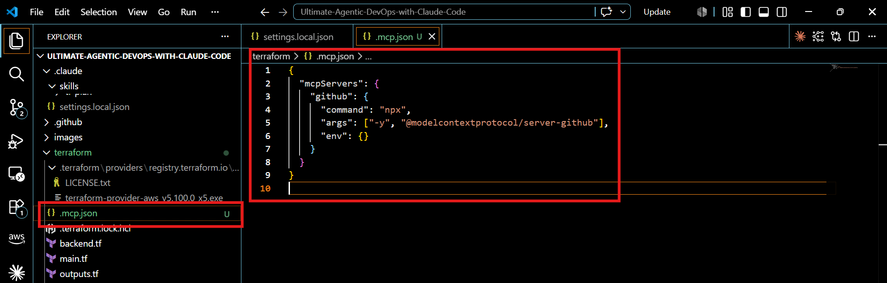.

---

# Task 3 — Add Your Token to settings.local.json

## Goal

Store your GitHub token securely in `.claude/settings.local.json` and ensure it is not committed to version control.

I created .claude/settings.local.json and stored my GitHub Personal Access Token in the env section using the GITHUB_PERSONAL_ACCESS_TOKEN environment variable.

I also enabled the GitHub MCP server through:

"enabledMcpjsonServers": ["github"]

The token remained in my local environment and was not added to .mcp.json or any tracked project file.

Real-World Application

In a real organization, credentials should be separated from application or infrastructure configuration.

This approach demonstrates the same principle used with environment variables, secret managers, and CI/CD secret stores: configuration can be shared, while sensitive credentials are injected securely at runtime.

This reduces the risk of accidentally exposing credentials through source control.

#### Screenshot 3 — `settings.local.json` open in VS Code showing the `env` section — **blur or cover the actual GitHub token value**

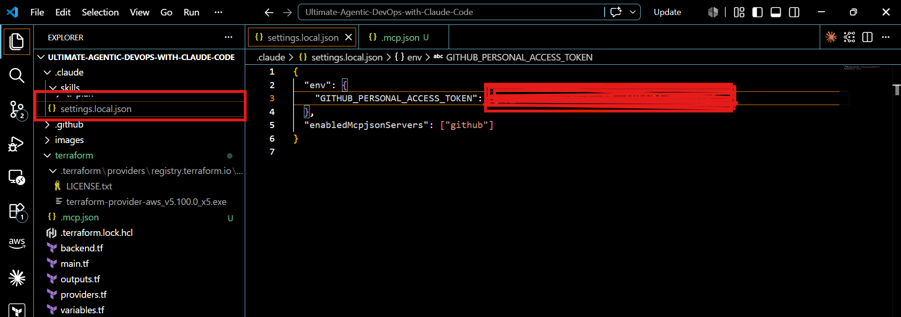.

I added .claude/settings.local.json to .gitignore.

I then checked the repository status with: git status to confirm that the local settings file containing my GitHub token was not being tracked by Git.

Real-World Application

In a real development team, sensitive configuration files must be excluded from source control.

Using .gitignore helps prevent developers from accidentally committing local credentials, API keys, tokens, or other environment-specific configuration.

This is part of secure credential management and preventing secrets from entering the Git history.

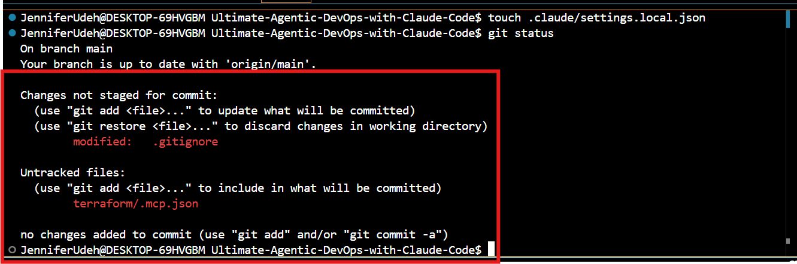.
---

# Task 4 — Verify the Connection with /mcp

## Goal

Confirm that the GitHub MCP server is successfully connected inside Claude Code.

I restarted Claude Code so that it could load the new MCP configuration.

I then used:

/mcp

to inspect the configured MCP servers and verified that the GitHub server showed as:

github: connected

This confirmed that Claude Code could successfully initialize the GitHub MCP server using my local authentication configuration.

Real-World Application

In a real organization, integrations should be verified before they are used in automation or production workflows.

Checking the MCP connection provides a simple validation step that confirms:

Claude Code → MCP configuration → Authentication → GitHub  is working correctly.

This is similar to validating connectivity and authentication when integrating CI/CD tools, cloud services, APIs, or monitoring platforms.

#### Screenshot 4 — `/mcp` output showing `github: connected`

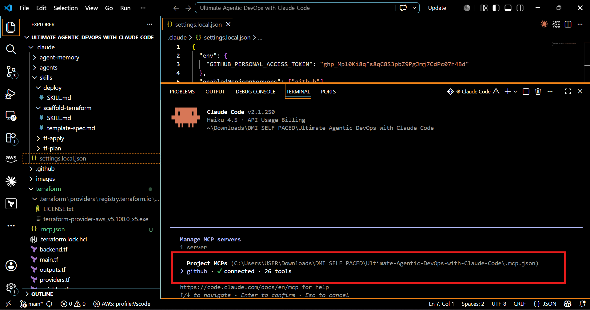.

---

# Task 5 — Run a Live GitHub Query

## Goal

Verify MCP functionality by retrieving real-time data from your GitHub account using Claude Code.

I used Claude Code with the GitHub MCP server to retrieve the README.md file from my GitHub repository:

Ujitech734/Ultimate-Agentic-DevOps-with-Claude-Code

I gave Claude the prompt to use GitHub MCP to retrieve the README, and Claude successfully called the GitHub MCP server and returned the repository's README content.

I verified that the response contained the actual content of the repository, including the DMI Portfolio Website description, deployment requirements, Nginx and Ubuntu VM setup, and the mandatory ownership proof.

This confirmed that the MCP connection was not only configured successfully but was actively allowing Claude to retrieve live data from GitHub.

Real-World Application

In a real organization, AI agents can be connected to development platforms such as GitHub to retrieve and work with information that exists outside the local development environment.

#### Screenshot 5 — Claude's response showing the GitHub MCP tool call and the retrieved README.md content.

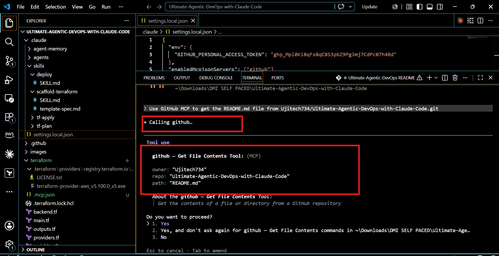.

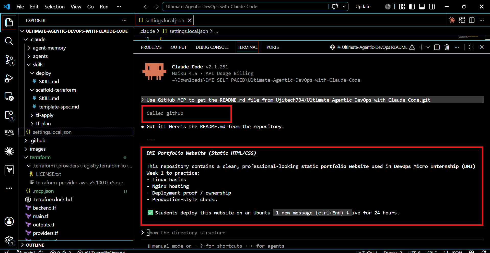.

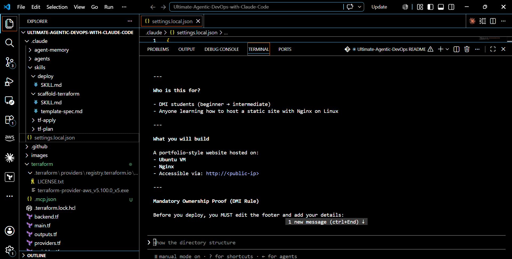.

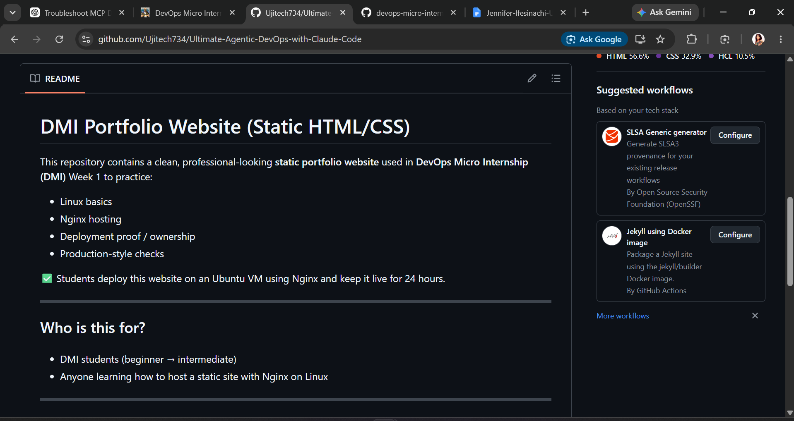.

---

# Submission Instructions

- Ensure `.mcp.json` is committed to your GitHub repository
- Ensure `.claude/settings.local.json` is NOT committed (must be gitignored)
- Confirm token value is hidden in all screenshots
- Add all required screenshots to your submission
- Push final changes to your forked repository

---

## GitHub Repository URL

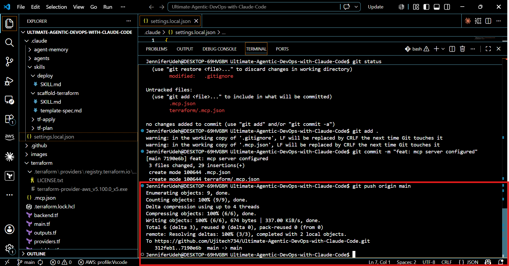.

Paste your forked repository URL here:

(https://github.com/Ujitech734/Ultimate-Agentic-DevOps-with-Claude-Code.git)

---

## Security Confirmation

Confirm below:

- [ ] `settings.local.json` is added to `.gitignore`
- [ ] GitHub token is NOT exposed in repository or screenshots

---

# Completion Checklist

- [ ] GitHub PAT created with correct scopes (`repo`, `read:user`)
- [ ] `.mcp.json` created at project root
- [ ] `.claude/settings.local.json` contains token (hidden in screenshot)
- [ ] `.claude/settings.local.json` is NOT committed
- [ ] `/mcp` shows GitHub connection as active
- [ ] Live GitHub query returns real repository data
- [ ] All required screenshots added
- [ ] GitHub repository URL included

---

## 📌 About DMI & CloudAdvisory

DevOps Micro Internship (DMI) is a project-based DevOps program run by Pravin Mishra (The CloudAdvisory) focused on real-world execution, systems thinking, and career readiness.

It helps learners build strong DevOps foundations with hands-on experience.

---

## 📌 Resources

- 🌐 DMI Official Website: https://dmi.pravinmishra.com?utm_source=github&utm_medium=readme  
- 🎓 University: https://university.pravinmishra.com?utm_source=github&utm_medium=readme  
- 💬 Discord Community: https://discord.pravinmishra.com?utm_source=github&utm_medium=readme  
- 📝 Blog: https://dmi.pravinmishra.com/blog?utm_source=github&utm_medium=readme  
- ▶️ YouTube Playlist: https://www.youtube.com/playlist?list=PLFeSNDtI4Cho  
- 🔗 Pravin Mishra (LinkedIn): https://www.linkedin.com/in/pravin-mishra-aws-trainer/  
- 🏢 CloudAdvisory (LinkedIn): https://www.linkedin.com/company/thecloudadvisory/

---

*This submission is part of DevOps Micro Internship (DMI) Cohort 3 — Agentic AI Track.*