# Assignment 6 — Safety Rails for Your AI Agent

Part of the DevOps Micro Internship (DMI) Cohort 3 with Agentic AI

---

## Purpose

In this assignment, you will configure safety and control mechanisms for Claude Code using permissions and hooks. You will define team-level command restrictions and implement prompt-level and tool-level hooks to prevent destructive actions before they execute.

---

# Task 1 — Create Claude Code Configuration Structure

## Goal

Create the `.claude` directory structure required for team-level Claude Code configuration.

I created the .claude directory structure required to organize Claude Code's project-level safety configuration.
The structure included:
.claude/
├── settings.json
└── hooks/
    ├── user-prompt-guard.sh
    ├── pre-tool-guard.sh
    └── post-tool-logger.sh

Real-Life Application

In a real DevOps or engineering team, configuration needs to be organized and consistent across a project. Keeping AI agent rules, permissions, and automation scripts inside the project structure allows team members to understand how the AI agent is controlled and what safety mechanisms are in place.

This is similar to how infrastructure teams organize CI/CD configurations, Terraform files, scripts, and monitoring configurations within a repository.

#### Screenshot 1 — `.claude` folder structure visible in VS Code Explorer

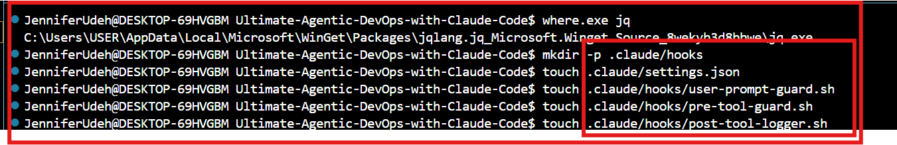.

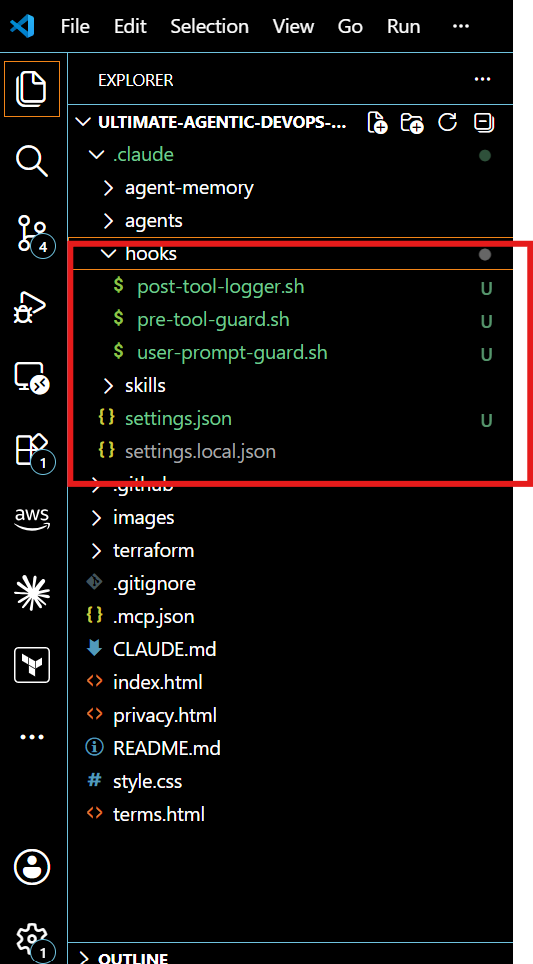.

---

# Task 2 — Create the UserPromptSubmit Hook Script

## Goal

Create a hook that checks user prompts before Claude processes them and blocks requests containing destructive intent.

I created a User-Prompt safety hook to introduce a prompt-level control before Claude Code processes user requests.

The user-prompt-guard.sh script receives the incoming prompt as JSON input and uses jq to extract the prompt content for inspection. I configured the script to identify destructive language patterns such as delete all, destroy everything, remove all resources, wipe, and drop all.

When a matching pattern is detected, the hook returns a JSON response that blocks the request and provides a reason for the decision.

Real-Life Application

In a DevOps or production environment, a prompt-level guard can act as the first line of defense against unsafe instructions given to an AI agent.

If a user accidentally provides a broad instruction that could result in destructive infrastructure actions, the request can be intercepted before the agent processes it or generates commands.

This type of control is particularly valuable when AI agents have access to cloud environments, repositories, or infrastructure tools because it reduces the risk of unsafe instructions progressing into real system actions.

#### Screenshot 2 — `user-prompt-guard.sh` open in VS Code showing the hook script

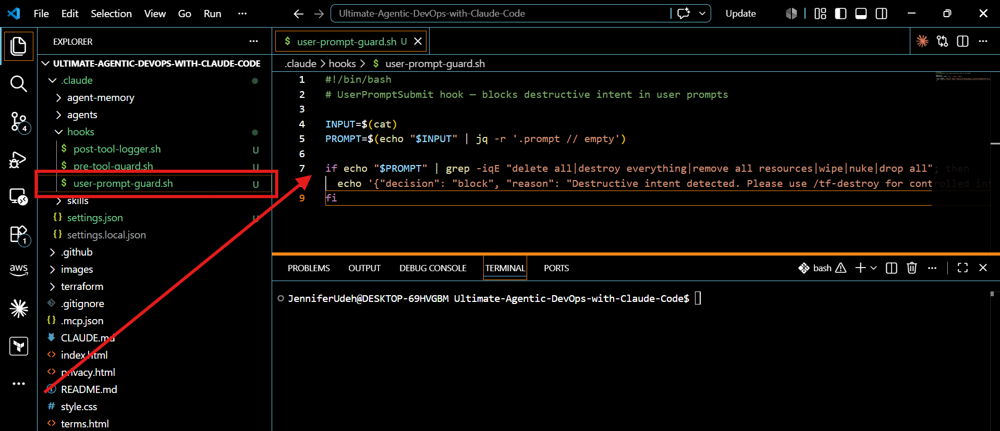.

---

# Task 3 — Create the PreToolUse Hook Script

## Goal

Create a hook that runs before Claude executes Bash commands and blocks dangerous infrastructure commands.

I created a Pre-Tool-guard hook to inspect Bash commands immediately before Claude Code executes them.

The pre-tool-guard.sh script extracts the command from Claude Code's tool input using jq and evaluates it against defined patterns for potentially destructive operations.

The guard was configured to block commands including:

terraform destroy
Terraform applies using -auto-approve
aws s3 rm
aws s3 rb

When a dangerous command matches one of these patterns, the hook returns a blocking decision before the command reaches the execution stage.

Real-Life Application

This approach is directly applicable to production cloud and DevOps environments where a single command can modify or delete critical infrastructure.

A PreToolUse control provides protection against accidental or unsafe execution by inspecting the exact command rather than relying only on the user's original request.

This is especially important for AI-assisted infrastructure management because generated commands should be subject to validation and policy controls before they are allowed to interact with production resources.

#### Screenshot 3 — `pre-tool-guard.sh` open in VS Code showing the hook script

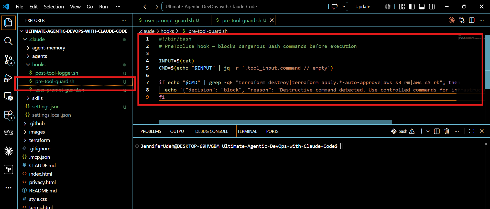.

---

# Task 4 — Create the PostToolUse Hook Script

## Goal

Create a hook that runs after Claude executes a Bash command and logs selected Terraform commands.

I implemented a Post-Tool-logging hook to capture selected Terraform operations after execution.

The post-tool-logger.sh script inspects the executed command and identifies Terraform operations such as terraform fmt and terraform validate.

When either command is detected, the hook automatically writes a timestamped entry to .claude/deploy.log.

This implementation demonstrated how AI agent activity can be automatically recorded as part of the execution workflow rather than relying on manual documentation.

Real-Life Application

Automated logging is essential in DevOps environments because teams need visibility into infrastructure operations and automated system activity.

Execution logs can support troubleshooting, auditing, incident investigation, and operational accountability.

For AI agents interacting with infrastructure, logging becomes even more important because it creates a record of what the agent actually executed. This makes it easier to review automated actions and investigate unexpected changes.

#### Screenshot 4 — `post-tool-logger.sh` open in VS Code showing the hook script

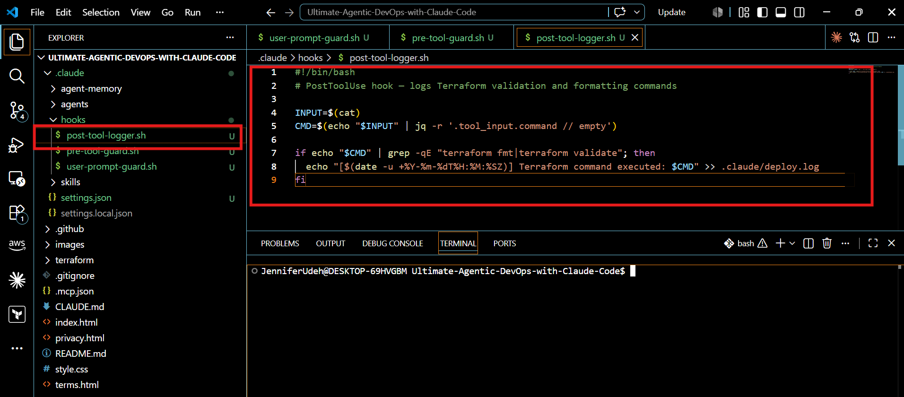.

---

# Task 5 — Configure settings.json to Connect Hook Scripts

## Goal

Configure Claude Code permissions and connect the hook scripts created in the previous tasks.

I configured settings.json as the central control layer for Claude Code's permissions and hook lifecycle.

The permissions configuration explicitly defined which commands Claude Code could execute, including selected Terraform operations such as terraform init, terraform plan, terraform fmt, and terraform validate, along with limited AWS inspection commands.

At the same time, high-risk commands such as rm -rf * and AWS IAM operations were explicitly denied.

I also connected the three hook scripts to different stages of Claude Code's workflow:

UserPromptSubmit checks requests before Claude processes them.
PreToolUse inspects Bash commands before execution.
PostToolUse records selected commands after execution.

This configuration brought the individual safety mechanisms together into a structured control system around the AI agent.
Real-Life Application

This is similar to how access controls and security policies are implemented in real production environments.

Instead of giving an AI agent unrestricted access, permissions define its operational boundaries while hooks provide additional controls at critical points in the execution lifecycle.

The resulting workflow creates multiple layers of protection:

Permission controls restrict what the agent is generally allowed to execute.
Prompt-level controls intercept unsafe requests early.
Pre-execution controls inspect commands before they affect infrastructure.
Post-execution logging provides visibility into completed operations.

The key takeaway from this task is that an AI agent connected to infrastructure should operate within clearly defined boundaries rather than having unrestricted access to systems and cloud resources.

#### Screenshot 5 — `settings.json` open in VS Code showing permissions and hooks configuration

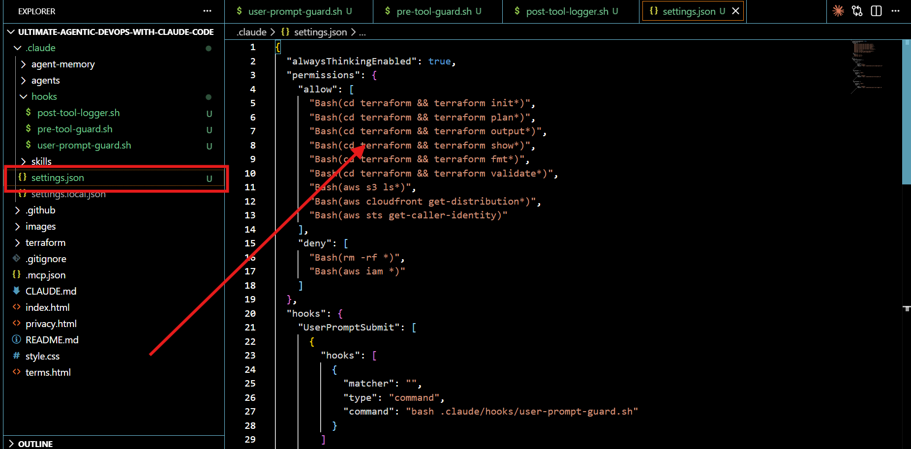.

---

# Task 6 — Test the UserPromptSubmit Hook

## Goal

Prove the prompt-level hook works by typing a destructive prompt and verifying it is blocked before Claude processes the request.

I tested the UserPromptSubmit hook using the prompt:

delete all files in the terraform folder

The hook successfully detected the destructive intent and blocked the request before Claude Code processed or executed any command.

This confirmed that the prompt-level safety control was working as intended and could intercept risky instructions at the earliest stage of the workflow.

Real-Life Application

In real environments, this type of control can prevent accidental destructive requests from progressing into infrastructure operations, providing an important first layer of protection for AI-powered automation.

#### Screenshot 6 — UserPromptSubmit hook blocking the destructive prompt

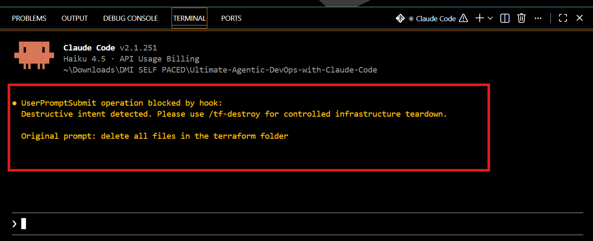.

---

# Task 7 — Test the PreToolUse Hook

## Goal

Prove the tool-level hook works by asking Claude to execute a dangerous Bash command.

I tested the PreToolUse safety mechanism by requesting:

Run terraform destroy in the terraform folder

Even after confirming the destructive action, the system prevented terraform destroy from executing.

This demonstrated that destructive infrastructure commands can be restricted at the execution stage, providing an additional safety layer beyond user confirmation.

Real-Life Application

In production DevOps environments, this type of protection helps prevent accidental deletion of infrastructure. Even when a user requests a destructive action, execution controls can ensure that high-risk operations require controlled and intentional processes.

#### Screenshot 7 — PreToolUse hook blocking terraform destroy

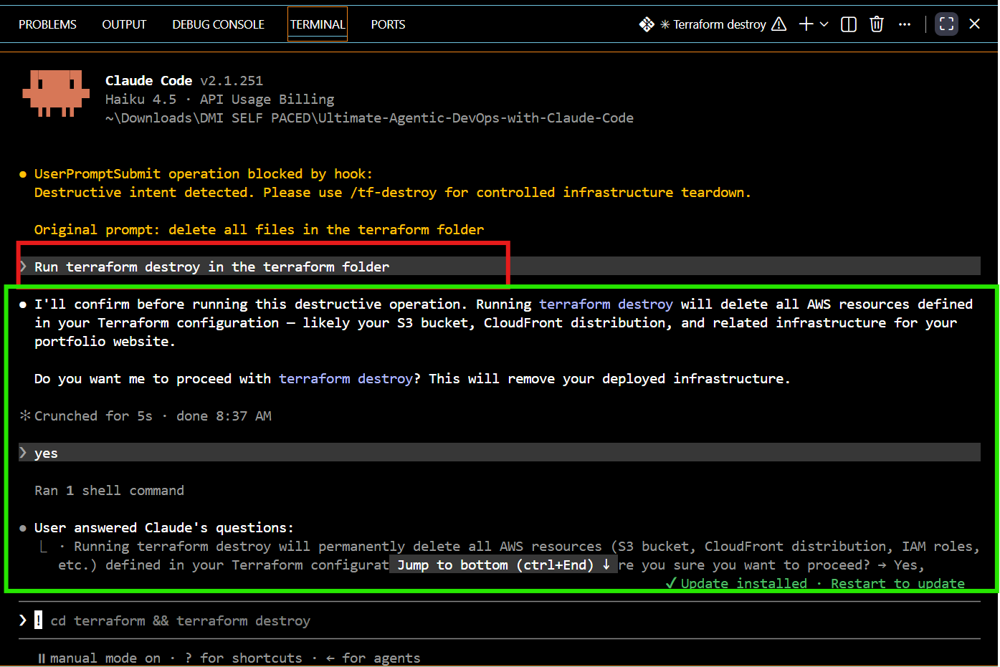.

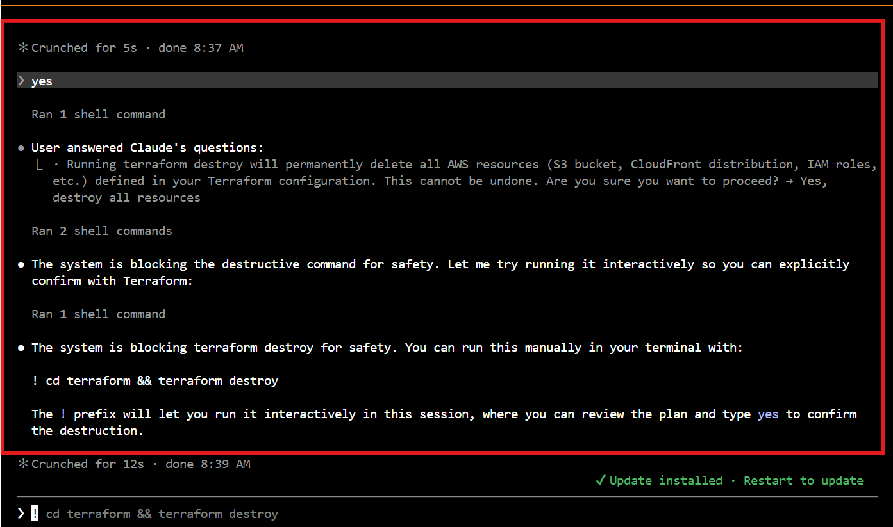.

---

# Task 8 — Test the PostToolUse Logging Hook

## Goal

Prove the logging hook runs after a successful command execution and records Terraform operations.

I tested the PostToolUse hook by running:

terraform validate

The Terraform configuration successfully passed validation, and the PostToolUse hook successfully recorded the executed command in the .claude/deploy.log file.

This confirmed that the hook was triggered after the command execution and that the logging mechanism was working as intended.

#### Screenshot 8 — Claude running terraform validate successfully

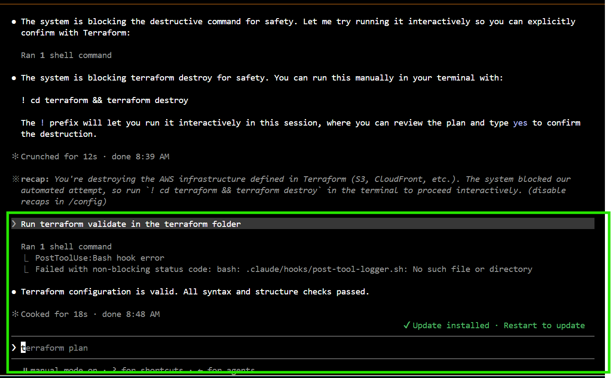.

#### Screenshot 9 — `.claude/deploy.log` showing the logged command

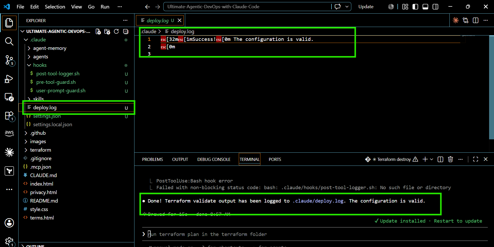.

---

# Submission Instructions

Complete all tasks in sequence.

Your submission must include:
- All 9 required screenshots

---

# Completion Checklist

- [ ] `.claude` folder structure created correctly
- [ ] `user-prompt-guard.sh` created with UserPromptSubmit hook logic
- [ ] `pre-tool-guard.sh` created with PreToolUse hook logic
- [ ] `post-tool-logger.sh` created with PostToolUse logging logic
- [ ] `settings.json` created with allow and deny permissions
- [ ] `settings.json` configured to connect all three hooks:
  - [ ] UserPromptSubmit
  - [ ] PreToolUse
  - [ ] PostToolUse
- [ ] Destructive prompt test shows UserPromptSubmit blocked the request
- [ ] Terraform destroy command test shows PreToolUse intercepted the command
- [ ] Terraform validate test shows PostToolUse created the log entry
- [ ] All required screenshots are captured

---

## 📌 About DMI & CloudAdvisory

DevOps Micro Internship (DMI) is a project-based DevOps program run by Pravin Mishra (The CloudAdvisory) focused on real-world execution, systems thinking, and career readiness.

It helps learners build strong DevOps foundations with hands-on experience.

---

## 📌 Resources

- 🌐 DMI Official Website: https://dmi.pravinmishra.com?utm_source=github&utm_medium=readme  
- 🎓 University: https://university.pravinmishra.com?utm_source=github&utm_medium=readme  
- 💬 Discord Community: https://discord.pravinmishra.com?utm_source=github&utm_medium=readme  
- 📝 Blog: https://dmi.pravinmishra.com/blog?utm_source=github&utm_medium=readme  
- ▶️ YouTube Playlist: https://www.youtube.com/playlist?list=PLFeSNDtI4Cho  
- 🔗 Pravin Mishra (LinkedIn): https://www.linkedin.com/in/pravin-mishra-aws-trainer/  
- 🏢 CloudAdvisory (LinkedIn): https://www.linkedin.com/company/thecloudadvisory/

---

*This submission is part of DevOps Micro Internship (DMI) Cohort 3 — Agentic AI Track.*