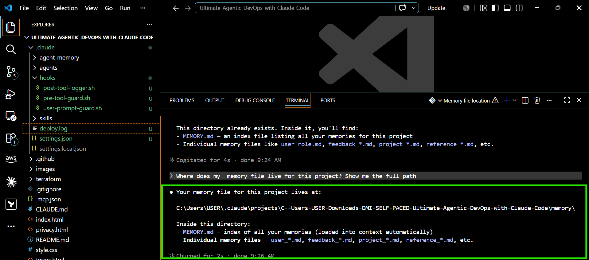
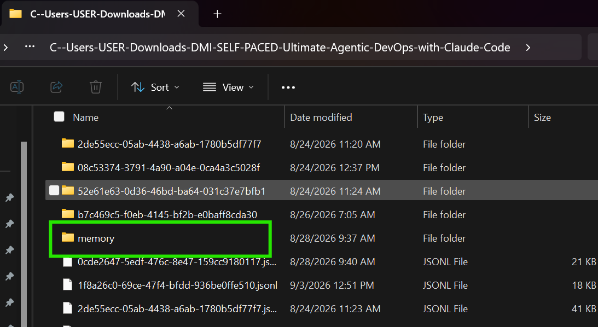
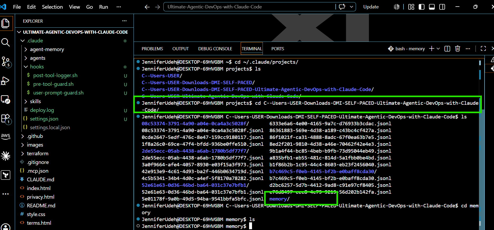
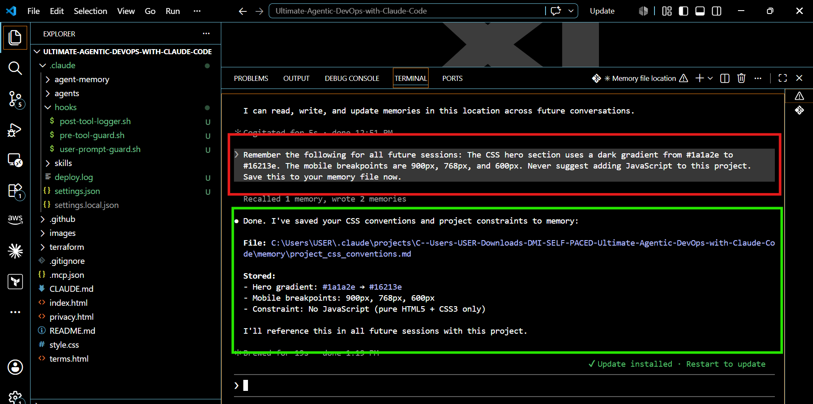
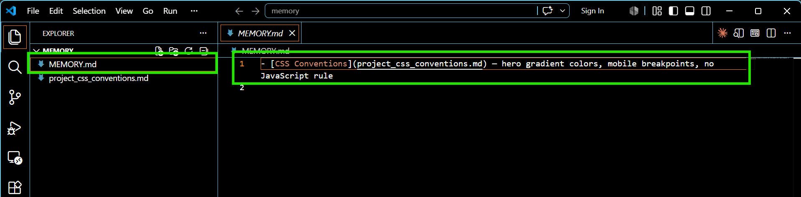
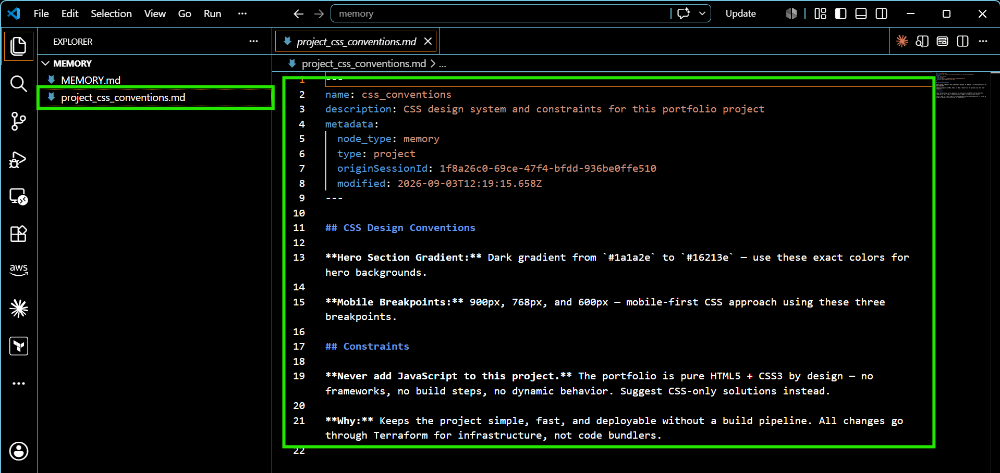
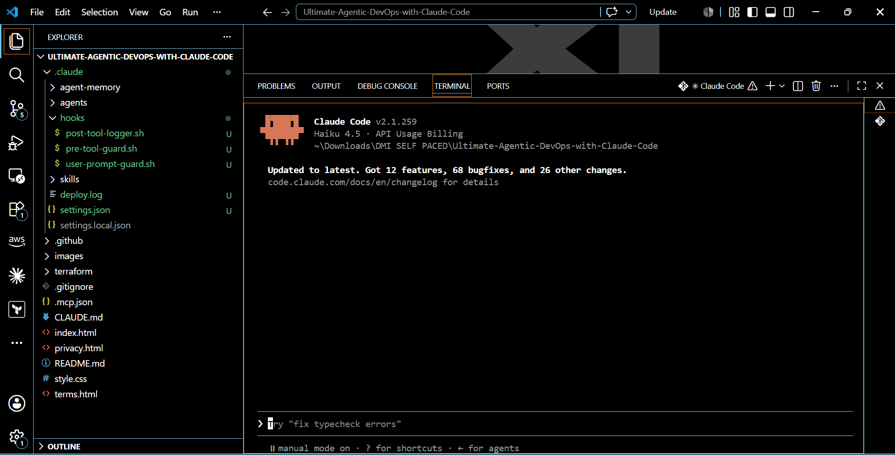
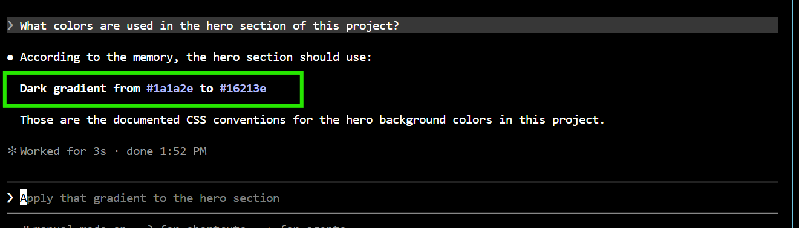
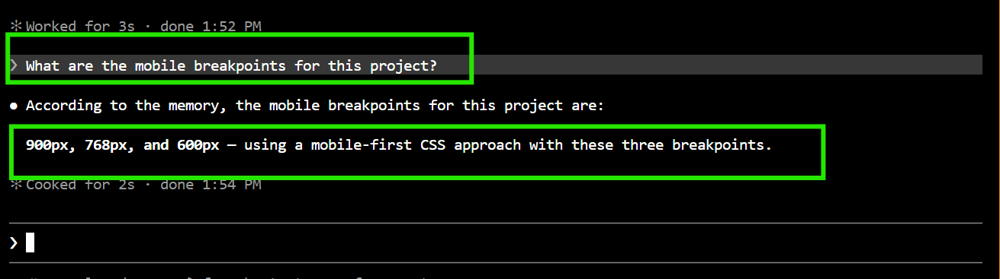
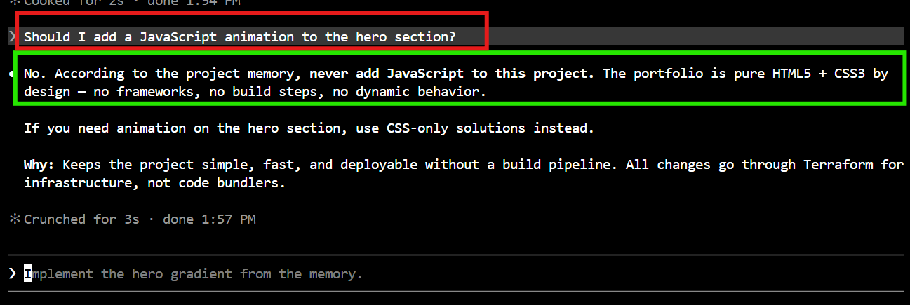

# Assignment 7 — A Claude That Remembers

Part of the DevOps Micro Internship (DMI) Cohort 3 with Agentic AI

---

## Purpose

In this assignment, I explored Claude Code’s memory system. I located the project memory file, store structured information into it, restarted the session, and verify that Claude can recall stored knowledge across sessions without being prompted again.

---

# Task 1 — Find the Memory File Location

## Goal

Discover exactly where Claude Code stores memory for this project.

I asked Claude Code to identify the location where project memory is stored using the prompt:

Where does your memory file live for this project? Show me the full path.

Claude identified the project memory location as:
C:\Users\USER\.claude\projects\C--Users-USER-Downloads-DMI-SELF-PACED-Ultimate-Agentic-DevOps-with-Claude-Code\memory\

The memory directory is located inside Claude Code's project-specific storage under .claude/projects/.

Real-Life Application

Persistent project memory allows an AI coding assistant to retain important project context across separate sessions. In a real development environment, this can help maintain consistency in architectural decisions, coding conventions, technical constraints, and project-specific rules without requiring the same information to be repeatedly provided.

#### Screenshot 1 — Memory file path shown by Claude

.

.

.

---

# Task 2 — Give Claude Information to Remember

## Goal

Teach Claude three specific facts about the project and instruct it to save them to the memory file.

I instructed Claude Code to permanently store the following project-specific information:

The hero section uses a dark gradient from #1a1a2e to #16213e.
The mobile breakpoints are 900px, 768px, and 600px.
JavaScript should not be suggested for the project.

Claude confirmed that the information was successfully stored and reported: Recalled 1 memory, wrote 2 memories

It also created a project-specific memory file: project_css_conventions.md
The stored information included the hero gradient, responsive breakpoints, and the project's no-JavaScript constraint.

Real-Life Application

Project-specific memory is useful for maintaining engineering consistency across long-running projects. For example, technical constraints and design decisions can persist across sessions, helping prevent an AI assistant from recommending solutions that conflict with previously established project requirements.

#### Screenshot 2 — Claude confirming the memory was saved

.

---

#### Screenshot 3 — The `MEMORY.md` file open in VS Code showing the saved content

.

.

---

# Task 3 — Close the Session Completely

## Goal

Terminate the current Claude Code session and restart it to ensure memory is the only persistent context source.

After saving the project-specific CSS conventions to Claude Code's memory, I exited the previous Claude Code session and reopened Claude Code in the same project directory.

The new session started successfully with Claude Code v2.1.259 and displayed a fresh session interface without the previous conversation history.

Real-Life Application

Session-independent memory is important when using AI assistants in long-running technical projects. Developers and DevOps engineers often work across multiple sessions, terminals, and development cycles. Persistent memory allows important project context to remain available without depending on the previous conversation history.

This makes it possible to test whether project conventions and constraints are genuinely retained and can be applied consistently in future sessions.

#### Screenshot 4 — VS Code reopened with a fresh Claude Code session showing no previous conversation

.

---

# Task 4 — Prove Memory Recall Across Sessions

## Goal

Run three tests that prove Claude remembers what you told it — without you saying it again in the new session.

### Evidence

#### Screenshot 5 — Claude recalling hero section colors

.

---

#### Screenshot 6 — Claude refusing JavaScript request based on memory rule

.

.
---

# Submission Instructions

- Ensure memory was successfully saved into `MEMORY.md`
- Restart Claude Code session completely before testing recall
- Add all required screenshots to your GitHub repository
- Push final changes to your forked repository

---

## Linkedin Post Link

https://www.linkedin.com/posts/jennifer-ifesinachi-udeh_dmibypravinmishra-agenticai-claudecode-activity-7439259531924246528-zqq_?utm_source=share&utm_medium=member_desktop&rcm=ACoAAFSVTNcBifpKhCEFba52OC8w7ZabwcMcXHw

---

## GitHub Repository URL

https://github.com/Ujitech734/Ultimate-Agentic-DevOps-with-Claude-Code.git

---

# Completion Checklist

- [ ] Memory file path identified (Screenshot 1)
- [ ] Memory successfully saved via prompt (Screenshot 2)
- [ ] `MEMORY.md` shows stored content (Screenshot 3)
- [ ] Fresh session opened after full restart (Screenshot 4)
- [ ] Claude recalled hero colors correctly (Screenshot 5)
- [ ] Claude refused JavaScript request based on memory (Screenshot 6)
- [ ] All screenshots added and committed to GitHub repo
- [ ] Linkedin post created.

---

## 📌 About DMI & CloudAdvisory

DevOps Micro Internship (DMI) is a project-based DevOps program run by Pravin Mishra (The CloudAdvisory) focused on real-world execution, systems thinking, and career readiness.

It helps learners build strong DevOps foundations with hands-on experience.

---

## 📌 Resources

- 🌐 DMI Official Website: https://dmi.pravinmishra.com?utm_source=github&utm_medium=readme  
- 🎓 University: https://university.pravinmishra.com?utm_source=github&utm_medium=readme  
- 💬 Discord Community: https://discord.pravinmishra.com?utm_source=github&utm_medium=readme  
- 📝 Blog: https://dmi.pravinmishra.com/blog?utm_source=github&utm_medium=readme  
- ▶️ YouTube Playlist: https://www.youtube.com/playlist?list=PLFeSNDtI4Cho  
- 🔗 Pravin Mishra (LinkedIn): https://www.linkedin.com/in/pravin-mishra-aws-trainer/  
- 🏢 CloudAdvisory (LinkedIn): https://www.linkedin.com/company/thecloudadvisory/

---

*This submission is part of DevOps Micro Internship (DMI) Cohort 3 — Agentic AI Track.*