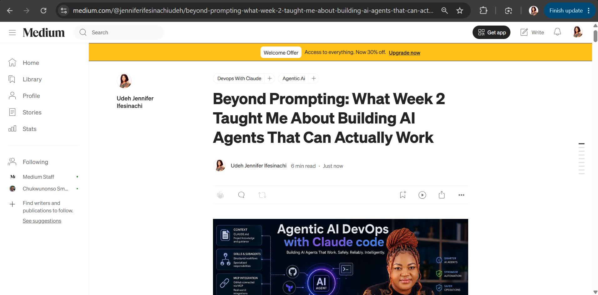
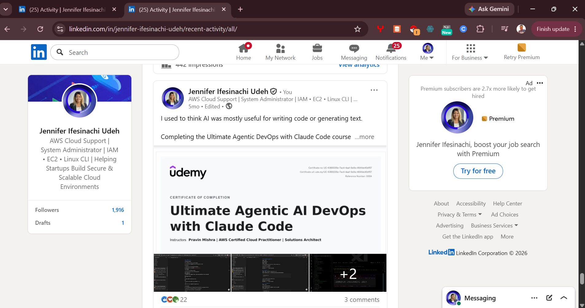

# Assignment 8 — Week 2 Reflection Blog

Part of the DevOps Micro Internship (DMI) Cohort 3 with Agentic AI

---

# Purpose

In this assignment, you will reflect on your Week 2 learning journey and write a short blog capturing your experience working with Agentic AI tools such as Claude Code, Skills, Subagents, MCP, Hooks, Permissions, and Memory.

You will also publish a LinkedIn post summarizing your learning and share both links for evaluation.

---

# Task 1 — Write Your Reflection Blog

## Goal

Write a reflection blog covering your Week 2 learning experience.

### Blog Requirements

Your blog must include:

* Title: **Reflection – Week 2**
* Minimum 300 words
* At least 2–3 topics from Week 2 (Claude Code, Skills, Subagents, MCP, Hooks, Permissions, Memory)
* Honest personal reflection (learning, challenges, mindset)
* One habit/system you plan to implement
* Your full name clearly visible

### Allowed Platforms

You can publish your blog on:

* Hashnode
* Medium
* Dev.to
* LinkedIn Article
* GitHub Markdown file
* Substack

---

This week, I went beyond simply prompting an AI coding assistant and explored what it actually takes to build a more structured and reliable agentic AI workflow.

I worked hands-on with Claude Code, CLAUDE.md, Skills, Subagents, MCP, Hooks, Permissions, and persistent memory — including troubleshooting real issues with MCP connections, hook configurations, and environment-specific differences.

One of my biggest takeaways:

Agentic AI is not just about telling AI what to do. It’s about designing the environment in which the AI operates.

Context. Boundaries. Permissions. Integrations. Verification. Logging. Memory.

I documented my Week 2 experience, the challenges I encountered, and the lessons I took away in my  Medium write-up:

📖 Beyond Prompting: What Week 2 Taught Me About Building AI Agents That Can Actually Work

#### Screenshot 1 — Blog published and visible

.


---

### Submission Field

Blog Link:

https://medium.com/@jenniferifesinachiudeh/beyond-prompting-what-week-2-taught-me-about-building-ai-agents-that-can-actually-work-8904e7e60020?source=friends_link&sk=f61a74931c66f86bf03b1f5367ec6104

---

# Task 2 — Create LinkedIn Post

## Goal

Share your Week 2 learning publicly on LinkedIn.

---

### LinkedIn Post Requirements

Your post must include:

* One screenshot from any Week 2 assignment
* Short reflection (what you learned or built)
* Required P.S. line exactly as given below

---

### Required P.S. Line (Must Include Exactly)

> **P.S. This post is part of the DevOps Micro Internship (DMI) with Agentic AI — Cohort 3 — by [Pravin Mishra](https://www.linkedin.com/in/pravin-mishra-aws-trainer/). My graded progress is public: https://dmi.pravinmishra.com/s/YOUR-GITHUB-USERNAME.html · Start your DevOps journey: https://dmi.pravinmishra.com/?utm_source=student&utm_medium=ps-linkedin&utm_campaign=cohort3**

---

### Suggested Hashtags

#DMIByPravinMishra #AgenticAI #ClaudeCode #DevOps #LearningInPublic

---

### Evidence

#### Screenshot 2 — LinkedIn post published

.

---

### Submission Field

LinkedIn Post Content (copy-paste here):

```
I used to think AI was mostly useful for writing code or generating text.

Completing the Ultimate Agentic DevOps with Claude Code course completely changed that perspective.

This journey was not easy, but grit kept me going. Looking back now, I’m honestly grateful for the experience because it opened my eyes to how AI agents can participate in real DevOps workflows when guided with the right structure and tools.

One of the first concepts I learned was CLAUDE.md.
 It acts as a guide for the AI agent, providing project context, architecture, rules, and conventions so the agent understands how to operate across the entire project.

Next, I learned about Skills :- structured instructions that allow the agent to perform specific tasks. Instead of relying on random prompts, the agent can scaffold Terraform code, run infrastructure plans, apply resources, and deploy applications in a more organized way.

Then came Subagents, which showed how specialized AI workers can handle focused tasks like security auditing, Terraform generation, and cost optimization without needing the entire conversation history.

Another powerful concept was MCP (Model Context Protocol):- This allows Claude to connect to external tools and services, meaning the agent can interact with live systems like Terraform and AWS, not just rely on built-in knowledge.

We also explored Hooks, which add an important safety layer.
Hooks can check prompts, block dangerous commands, and log activity. For example, destructive commands like terraform destroy can be stopped before execution to protect infrastructure.

During this course I built and experimented with several practical implementations:
• A live website deployed on AWS using Terraform
 • Infrastructure generated using Claude Skills
 • An audit → fix → verify workflow using subagents
 • MCP connections allowing agents to interact with Terraform and AWS tools
 • Safety hooks that block risky commands and log deployment activity

Seeing these pieces work together helped me understand how structured and controlled agent workflows can power modern DevOps systems.

A big thank you to Pravin Mishra for creating such a practical and hands-on course.

P.S. This post is part of the DevOps Micro Internship (DMI) with Agentic AI — Cohort 3 — by [Pravin Mishra](https://lnkd.in/gQXwpFKU). My graded progress is public: https://lnkd.in/eNnRBgrG · Start your DevOps journey: https://lnkd.in/eqapXqp3

hashtag#DMIByPravinMishra hashtag#AgenticAI hashtag#ClaudeCode hashtag#DevOps hashtag#LearningInPublic
```

---

### LinkedIn Post Link:

(https://www.linkedin.com/posts/jennifer-ifesinachi-udeh_dmibypravinmishra-agenticai-claudecode-activity-7439259531924246528-zqq_?utm_source=share&utm_medium=member_desktop&rcm=ACoAAFSVTNcBifpKhCEFba52OC8w7ZabwcMcXHw)

https://www.linkedin.com/posts/jennifer-ifesinachi-udeh_beyond-prompting-what-week-2-taught-me-about-activity-7501937650300264448-o0Ak?utm_source=share&utm_medium=member_desktop&rcm=ACoAAFSVTNcBifpKhCEFba52OC8w7ZabwcMcXHw

---

# Submission Instructions

* Blog must be publicly accessible
* LinkedIn post must be visible (public or unlisted where applicable)
* All required fields must be filled
* Screenshot proofs must be added to GitHub repository
* Do not include sensitive information in blog or post

---

# Completion Checklist

* [ ] Blog written with required structure
* [ ] Blog includes at least 2–3 Week 2 topics
* [ ] Blog is publicly accessible
* [ ] LinkedIn post created
* [ ] Required P.S. line included
* [ ] LinkedIn post content copied in submission field
* [ ] Blog link added
* [ ] LinkedIn post link added
* [ ] Screenshots added to GitHub repo

---

# About DMI & CloudAdvisory

DevOps Micro Internship (DMI) is a project-based DevOps program run by Pravin Mishra (The CloudAdvisory), focused on real-world execution, systems thinking, and agentic AI workflows.

It helps learners build strong DevOps foundations through hands-on experience.

---

# Resources

* 🌐 DMI Official Website: [https://dmi.pravinmishra.com?utm_source=github&utm_medium=readme](https://dmi.pravinmishra.com?utm_source=github&utm_medium=readme)
* 🎓 University: [https://university.pravinmishra.com?utm_source=github&utm_medium=readme](https://university.pravinmishra.com?utm_source=github&utm_medium=readme)
* 💬 Discord Community: [https://discord.pravinmishra.com?utm_source=github&utm_medium=readme](https://discord.pravinmishra.com?utm_source=github&utm_medium=readme)
* 📝 Blog: [https://dmi.pravinmishra.com/blog?utm_source=github&utm_medium=readme](https://dmi.pravinmishra.com/blog?utm_source=github&utm_medium=readme)
* ▶️ YouTube Playlist: [https://www.youtube.com/playlist?list=PLFeSNDtI4Cho](https://www.youtube.com/playlist?list=PLFeSNDtI4Cho)
* 🔗 Pravin Mishra (LinkedIn): [https://www.linkedin.com/in/pravin-mishra-aws-trainer/](https://www.linkedin.com/in/pravin-mishra-aws-trainer/)
* 🏢 CloudAdvisory (LinkedIn): [https://www.linkedin.com/company/thecloudadvisory/](https://www.linkedin.com/company/thecloudadvisory/)

